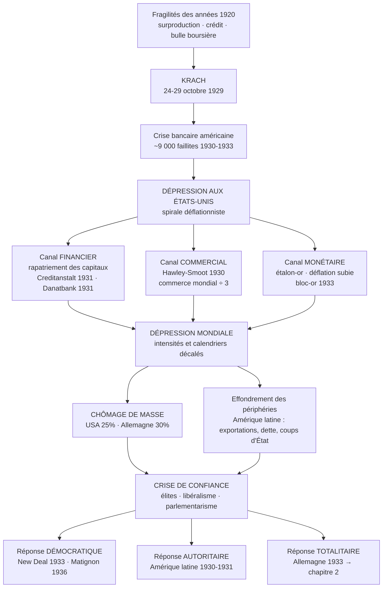

# HISTOIRE — Terminale générale (tronc commun)

## Thème 1 — Fragilités des démocraties, totalitarismes et Seconde Guerre mondiale (1929-1945)
### Chapitre 1 — L'impact de la crise de 1929 : déséquilibres économiques et sociaux

---

> **Cadre réglementaire.** Programme d'histoire-géographie de terminale générale, arrêté du 19 juillet 2019, publié au *Bulletin officiel spécial n° 8 du 25 juillet 2019* (Annexe 1). Programme annuel d'histoire : **48 heures**. Thème 1 : **13-15 heures**. Ce chapitre : **4 à 5 heures** (cours dialogué + 3 études de cas + méthodologie + évaluation).
>
> **Évaluation au baccalauréat.** Depuis la session 2022, l'histoire-géographie du tronc commun n'est plus évaluée par une épreuve terminale : elle relève du **contrôle continu**, avec un **coefficient 6** sur le cycle terminal (3 en première + 3 en terminale). Les moyennes annuelles comptent donc directement dans la note du baccalauréat. Les exercices de référence restent la **composition** et l'**analyse critique de document(s)**.

---

## SOMMAIRE

1. [Ce que dit le programme](#1--ce-que-dit-le-programme)
2. [Place du chapitre dans le thème et dans la scolarité](#2--place-du-chapitre-dans-le-thème-et-dans-la-scolarité)
3. [Lexique fondamental — les notions à maîtriser](#3--lexique-fondamental--les-notions-à-maîtriser)
4. [Introduction du cours](#4--introduction-du-cours)
5. [I. D'un krach américain à une dépression mondiale (1929-1932)](#i--dun-krach-américain-à-une-dépression-mondiale-1929-1932)
6. [II. Une crise sociale : le chômage de masse et l'ébranlement des sociétés](#ii--une-crise-sociale--le-chômage-de-masse-et-lébranlement-des-sociétés)
7. [III. Les réponses politiques : la démocratie à l'épreuve (1933-1938)](#iii--les-réponses-politiques--la-démocratie-à-lépreuve-1933-1938)
8. [Conclusion](#conclusion)
9. [Schéma-bilan](#schéma-bilan)
10. [Repères chronologiques exigibles](#repères-chronologiques-exigibles)
11. [Encadré historiographique](#encadré-historiographique--pourquoi-les-historiens-ne-sont-pas-daccord)
12. [Méthodologie : l'analyse critique de document](#méthodologie--lanalyse-critique-de-document)
13. [Méthodologie : la composition](#méthodologie--la-composition)
14. [Erreurs fréquentes à ne pas commettre](#erreurs-fréquentes-à-ne-pas-commettre)
15. [Exercices d'auto-évaluation](#exercices-dauto-évaluation)
16. [Fiche de révision — l'essentiel en une page](#fiche-de-révision--lessentiel-en-une-page)
17. [Pour aller plus loin](#pour-aller-plus-loin--bibliographie-et-sitographie)

---

## 1 — Ce que dit le programme

**Citation textuelle du BO (Annexe 1, p. 6) :**

> **Objectifs.** « Ce chapitre vise à montrer l'impact de la crise économique mondiale sur les sociétés et les équilibres politiques, à court, moyen et long terme.
> On peut mettre en avant :
> — les causes de la crise ;
> — le passage d'une crise américaine à une crise mondiale ;
> — l'émergence d'un chômage de masse. »

> **Points de passage et d'ouverture.**
> — « les conséquences de la crise de 1929 en Amérique latine » ;
> — « 1933 : un nouveau président des États-Unis, F. D. Roosevelt, pour une nouvelle politique économique, le New Deal » ;
> — « Juin 1936 : les accords Matignon ».

### Comment lire cet intitulé (analyse de l'énoncé)

Trois mots commandent tout le chapitre.

| Mot de l'intitulé | Ce qu'il impose |
|---|---|
| **« impact »** | Le sujet n'est pas la crise elle-même, mais **ce qu'elle produit**. Les causes sont un point de départ, pas un développement. Éduscol signale explicitement le piège : « *s'attarder sur les causes de la crise économique* ». |
| **« déséquilibres »** | La crise ne frappe **ni partout, ni également, ni en même temps** : elle crée des écarts entre pays, entre secteurs, entre groupes sociaux. Le raisonnement doit être **différencié et multiscalaire**. |
| **« économiques et sociaux »** | Deux niveaux d'analyse liés mais distincts : la mécanique économique (production, prix, échanges) et l'expérience sociale (emploi, revenus, statuts, peurs). |

**Le mot absent, et pourtant central : *politique*.** L'objectif du programme dit « les sociétés **et les équilibres politiques** ». Ce chapitre est le socle des chapitres 2 et 3 : il explique pourquoi les démocraties entrent en 1930 dans une phase de **fragilité**.

### Points de passage et d'ouverture : ce qu'ils sont, ce qu'ils ne sont pas

Le programme les définit ainsi : ils « mettent en avant des dates-clefs, des lieux ou des personnages historiques » et ouvrent « un moment privilégié de mise en œuvre de la démarche historique et d'étude critique des documents ». Il précise aussitôt : « **Ils ne sauraient toutefois à eux seuls permettre de traiter le chapitre.** »

Autrement dit : ce ne sont **pas trois sous-parties**, mais **trois loupes** posées sur un récit d'ensemble. Ici, les trois PPO ont été choisis pour construire un raisonnement à trois échelles :

- **Amérique latine** → échelle des **périphéries** : la crise vue depuis les économies dominées ;
- **États-Unis** → échelle du **foyer** : la crise vue depuis son épicentre, et la réponse réformiste ;
- **France** → échelle **nationale européenne** : une crise décalée, une réponse tardive, dans un contexte de menace antidémocratique.

### Capacités et méthodes travaillées (programme, p. 3-4)

| Capacité | Mise en œuvre dans ce chapitre |
|---|---|
| **Connaître et se repérer** | Situer 1929-1939 dans l'entre-deux-guerres ; localiser les foyers et les relais de la crise. |
| **Contextualiser** | Mettre le krach en perspective avec la Première Guerre mondiale, les réparations, les années 1920. |
| **Employer les notions** | Distinguer rigoureusement krach / crise / dépression / déflation / récession. |
| **Conduire une démarche historique** | Construire et vérifier une hypothèse : « la crise a-t-elle mécaniquement produit les régimes autoritaires ? » |
| **Analyse critique de document** | Discours de Roosevelt (4 mars 1933) ; texte des accords Matignon ; séries statistiques. |
| **Analyse multiscalaire** | Passer de l'échelle mondiale (commerce) à l'échelle nationale et locale (une usine occupée en juin 1936). |

---

## 2 — Place du chapitre dans le thème et dans la scolarité

**Ce que les élèves savent déjà (acquis de première) :** la Première Guerre mondiale et ses conséquences (traité de Versailles, réparations, dette de guerre, sortie de guerre difficile), la fragilité des démocraties nouvelles, l'industrialisation et la société industrielle du XIX<sup>e</sup> siècle.

**Ce que ce chapitre ouvre :**

```
Chapitre 1 (crise) ──────► Chapitre 2 (régimes totalitaires) ──────► Chapitre 3 (Seconde Guerre mondiale)
   fragilisation              radicalisation idéologique                déchaînement de violence
```

**Attention méthodologique majeure, à poser dès la première heure.** La succession chronologique n'est **pas** une relation de cause à effet automatique. La crise de 1929 n'a pas « fabriqué » Hitler : le fascisme italien est au pouvoir depuis 1922, le régime soviétique depuis 1917. Ce que fait la crise, c'est **abaisser le seuil de résistance des sociétés démocratiques** et rendre audible un discours de rupture. La démonstration du chapitre consiste précisément à montrer que **face au même choc, les réponses ont divergé** : le New Deal et le Front populaire prouvent que la démocratie disposait d'autres issues que l'autoritarisme.

---

## 3 — Lexique fondamental — les notions à maîtriser

> **Règle de travail.** Une notion mal définie produit un raisonnement faux. Chaque définition ci-dessous doit être connue **avec sa nuance** : c'est la nuance qui est évaluée.

### A. Le vocabulaire de la conjoncture

**Krach** *(de l'allemand* Krach*, « fracas »)* — Effondrement brutal et de grande ampleur des cours sur un marché financier. C'est un **événement**, daté, de quelques jours. → *Le krach d'octobre 1929.*

**Crise (économique)** — Au sens strict et technique : le **moment de retournement** de la conjoncture, le point de rupture entre expansion et contraction. Au sens large et courant : l'ensemble de la période de difficultés. → *Employer le mot en précisant le sens retenu.*

**Récession** — Recul de l'activité économique, conventionnellement mesuré par au moins **deux trimestres consécutifs** de baisse du PIB. Phénomène **conjoncturel**, relativement bref.

**Dépression** — Contraction **profonde et durable** (plusieurs années) de la production, des prix et de l'emploi. C'est le terme historiquement exact pour 1929-1939, d'où l'expression consacrée : **la Grande Dépression**.

> ⚠️ **Le krach n'est pas la crise, et la crise n'est pas la dépression.** Le krach est le déclencheur visible ; la dépression est le processus long. Confondre les trois est l'erreur la plus fréquemment sanctionnée dans ce chapitre.

### B. Le vocabulaire financier

**Spéculation** — Opération consistant à acheter un actif dans le seul but de le revendre plus cher, en pariant sur la variation de son prix, et non sur son rendement.

**Achat sur marge** *(margin buying)* — Achat d'actions financé à crédit : l'investisseur ne verse qu'une fraction du prix (parfois 10 %) et emprunte le reste auprès d'un courtier, les titres achetés servant de garantie. **Mécanisme d'amplification** : il démultiplie les gains à la hausse comme les pertes à la baisse.

**Bulle spéculative** — Écart croissant et auto-entretenu entre le prix d'un actif et sa valeur économique fondamentale. Une bulle ne se dégonfle presque jamais : elle éclate.

**Prêteur en dernier ressort** — Institution (banque centrale) capable de fournir des liquidités à un système bancaire menacé de faillite en chaîne. **Son absence, ou son inaction, est un facteur central de l'aggravation de 1929-1933.**

### C. Le vocabulaire monétaire et commercial

**Étalon-or** *(gold standard)* — Système monétaire dans lequel la monnaie est définie par un poids d'or et convertible en or à parité fixe. Il garantit la stabilité des changes mais **interdit toute politique monétaire autonome** : un pays en crise ne peut ni dévaluer ni créer de la monnaie sans sortir du système.

**Déflation** — **Baisse durable et généralisée du niveau général des prix.** À ne pas confondre avec la *désinflation* (simple ralentissement de la hausse des prix). Ses effets sont pervers : elle **alourdit le poids réel des dettes** (on rembourse avec une monnaie devenue plus « chère »), et elle **incite à différer les achats** (pourquoi acheter aujourd'hui ce qui sera moins cher demain ?), ce qui déprime encore la demande. → **spirale déflationniste.**

**Politique déflationniste** — Politique délibérée de réduction des dépenses publiques, des salaires et des prix, destinée à restaurer la compétitivité **sans dévaluer** la monnaie. Appliquée par Brüning en Allemagne (1930-1932) et par Laval en France (décrets-lois de juillet 1935). Elle a partout **aggravé** la dépression.

**Dévaluation** — Décision d'un État d'abaisser la valeur officielle de sa monnaie par rapport à l'or ou aux autres devises, afin de renchérir les importations et d'abaisser le prix des exportations.

**Protectionnisme** — Politique de protection de la production nationale au moyen de barrières douanières, de contingents (quotas) ou de normes.

**Autarcie** — Recherche de l'autosuffisance économique, refus assumé des échanges extérieurs. Elle sera un pilier des économies allemande et italienne des années 1930.

### D. Le vocabulaire social et politique

**Chômage de masse** — Chômage **durable, massif et transversal** (touchant tous les secteurs et toutes les qualifications), par opposition au chômage frictionnel (bref, lié au changement d'emploi). Il devient dans les années 1930 un **fait social total** : appauvrissement, déclassement, perte de statut, désaffiliation.

**Libéralisme économique / *laissez-faire*** — Doctrine selon laquelle le marché s'autorégule et l'intervention de l'État est inefficace, voire nuisible. Doctrine **dominante en 1929**, et l'une des clés de la lenteur des réactions.

**Interventionnisme** — Action volontaire de l'État dans la vie économique et sociale (régulation, dépense publique, commande, protection).

**Keynésianisme** — Théorie issue de John Maynard Keynes (*Théorie générale de l'emploi, de l'intérêt et de la monnaie*, **1936**) : en dépression, l'insuffisance de la **demande globale** entretient le sous-emploi ; l'État doit donc soutenir la demande par la dépense publique, quitte à accepter un déficit budgétaire.

**New Deal** — « Nouvelle donne ». Ensemble des politiques conduites par F. D. Roosevelt à partir de 1933, articulant secours (*relief*), relance (*recovery*) et réforme (*reform*).

**État-providence** *(Welfare State)* — État qui prend en charge la protection des individus contre les risques sociaux (chômage, vieillesse, maladie). Le *Social Security Act* de 1935 en est un acte fondateur aux États-Unis.

**Convention collective** — Accord écrit négocié entre organisations syndicales de salariés et représentants des employeurs, fixant pour toute une branche les conditions de travail et de rémunération.

**Ligues** — Mouvements français des années 1930, nationalistes, antiparlementaires et souvent paramilitaires (Action française, Croix-de-Feu, Jeunesses patriotes, Solidarité française, Francisme). Leur activisme culmine lors de l'émeute du **6 février 1934**.

**Industrialisation par substitution aux importations (ISI)** — Stratégie de développement consistant à produire localement, derrière des barrières protectionnistes, les biens manufacturés jusque-là importés.

**Économie primaire-exportatrice** — Économie dont les revenus dépendent de l'exportation d'un très petit nombre de produits primaires (café, nitrates, cuivre, viande, blé). **Structure de dépendance** : elle rend le pays extrêmement vulnérable à la variation des cours mondiaux.

---

## 4 — Introduction du cours

### Accroche

Le **jeudi 24 octobre 1929**, à la Bourse de New York, près de 13 millions de titres sont jetés sur le marché en une seule séance — un volume six fois supérieur à la normale. Les téléscripteurs, saturés, accusent une heure et demie de retard : les vendeurs ne connaissent plus le prix auquel ils vendent. Cinq jours plus tard, le **mardi 29 octobre**, plus de 16 millions de titres changent de mains. En trois semaines, la valeur des actions cotées à Wall Street a fondu de près de moitié.

Ce qui n'est alors, pour les contemporains, qu'un accident boursier américain de plus va devenir la matrice d'une décennie. Trois ans plus tard, un ouvrier américain sur quatre est sans emploi, l'Allemagne compte six millions de chômeurs, le Chili a perdu quatre cinquièmes de ses recettes d'exportation, et sept États d'Amérique latine ont changé de régime par la force.

### Délimitation du sujet

- **Bornes chronologiques.** **1929** : le krach d'octobre, événement déclencheur. **1939** : l'entrée en guerre, qui referme la séquence en substituant l'économie de guerre à l'économie de crise. Le cœur du chapitre est la décennie 1929-1939, avec un temps fort en 1932-1933 (le creux) et en 1933-1936 (les réponses).
- **Bornes spatiales.** Le monde, mais analysé de manière **différenciée** : le foyer nord-américain, les relais européens, les périphéries primaires-exportatrices.
- **Objets d'étude.** Les mécanismes économiques ; les effets sociaux ; les recompositions politiques.

### Problématique

> **En quoi la crise économique mondiale née en 1929 a-t-elle déséquilibré durablement les sociétés, et pourquoi les réponses qu'elle a suscitées ont-elles divergé au point de mettre en jeu la survie même des régimes démocratiques ?**

*(Problématiques alternatives recevables : « Comment une crise financière américaine est-elle devenue une crise mondiale, sociale puis politique ? » — « Face au même choc économique, pourquoi les sociétés n'ont-elles pas apporté les mêmes réponses ? »)*

### Annonce du plan

Nous montrerons d'abord **comment un accident boursier américain s'est transformé en dépression mondiale**, par un jeu d'enchaînements financiers, commerciaux et monétaires (I). Nous analyserons ensuite **ce que cette dépression a fait aux sociétés**, à travers l'expérience nouvelle du chômage de masse (II). Nous étudierons enfin **les réponses politiques** apportées à la crise, et ce qu'elles révèlent de la capacité — ou de l'incapacité — des démocraties à se réformer (III).

---

## I — D'un krach américain à une dépression mondiale (1929-1932)

### A. Les fragilités d'une prospérité (les années 1920)

Les États-Unis sortent grands vainqueurs économiques de la Première Guerre mondiale : ils sont devenus **créanciers** de l'Europe et concentrent, à la fin de la décennie, environ **45 % de la production industrielle mondiale**. La prospérité des *Roaring Twenties* repose sur la production de masse (taylorisme, fordisme), la consommation de biens durables (automobile, électroménager, radio) et la diffusion du **crédit à la consommation**.

Mais cette prospérité est déséquilibrée sur trois points, qu'il suffit d'énoncer sans les développer :

1. **Une surproduction latente.** L'offre progresse plus vite que le pouvoir d'achat, en particulier dans l'agriculture, en surproduction chronique depuis 1921 ; les prix agricoles baissent et endettent les fermiers.
2. **Un endettement généralisé.** L'achat à crédit soutient artificiellement la demande ; l'encours du crédit à la consommation explose.
3. **Une bulle boursière.** L'indice Dow Jones passe d'environ 100 points en 1924 à **381 points le 3 septembre 1929**. La hausse est alimentée par l'**achat sur marge** : on emprunte pour acheter des titres dont on parie qu'ils monteront. **La Bourse s'est déconnectée de l'économie réelle.**

> 📌 **Point de vigilance.** Le programme demande de « mettre en avant les causes de la crise », mais Éduscol met en garde contre le fait de « s'attarder » dessus. **Une dizaine de lignes suffisent dans une composition.** Le sujet, c'est l'impact.

### B. Octobre 1929 : le krach, ou la conversion d'une bulle en effondrement

L'engrenage est brutal et instructif :

| Date | Événement | Mécanisme |
|---|---|---|
| **24 octobre 1929** | « **Jeudi noir** » : ~12,9 millions de titres vendus | Les ordres de vente s'accumulent ; les banques new-yorkaises tentent un soutien coordonné, qui échoue. |
| **28 octobre** | « Lundi noir » : −13 % | Les courtiers exigent le remboursement des prêts sur marge (*margin calls*). |
| **29 octobre 1929** | « **Mardi noir** » : ~16,4 millions de titres | Ventes forcées : pour rembourser, les spéculateurs doivent vendre, ce qui fait encore baisser les cours. **Boucle auto-entretenue.** |
| **8 juillet 1932** | Dow Jones à **41,22 points** | Point le plus bas : environ **−89 %** par rapport au sommet de septembre 1929. |

**Ce qu'il faut comprendre :** le krach n'appauvrit directement qu'une minorité (moins de 1,5 million de familles américaines sur 30 millions détiennent des titres, et une partie seulement spécule). **Le krach n'est pas la crise : il est le détonateur d'un mécanisme bancaire.**

### C. Du krach à la dépression : la mécanique interne américaine

C'est le passage décisif du chapitre. Trois enchaînements se combinent :

**1. La contagion bancaire.** Les banques ont prêté aux spéculateurs et placé leurs propres fonds en Bourse. Leurs pertes déclenchent des **paniques bancaires** (*bank runs*) : les déposants se ruent aux guichets, ce qui précipite des établissements pourtant sains. Entre 1930 et 1933, **environ 9 000 banques américaines font faillite**, soit plus du tiers du système bancaire.

**2. L'assèchement du crédit.** Les banques survivantes cessent de prêter. Les entreprises ne trouvent plus à financer leurs stocks ni leurs investissements : elles licencient et ferment.

**3. La spirale déflationniste.** La demande s'effondre → les prix baissent → les entreprises voient leurs recettes fondre → elles licencient → la demande s'effondre davantage. Entre 1929 et 1933, la **production industrielle américaine chute de près de moitié** et le produit national brut nominal recule d'environ 45 %.

**Le facteur aggravant : l'inaction doctrinale.** Fidèles à l'orthodoxie libérale, les dirigeants — au premier rang desquels le président **Herbert Hoover** (1929-1933) — considèrent la crise comme une « purge » nécessaire et refusent d'intervenir massivement. La **Réserve fédérale** ne joue pas son rôle de prêteur en dernier ressort et laisse la masse monétaire se contracter d'environ un tiers. *(→ voir l'encadré historiographique.)*

### D. La mondialisation de la crise : trois canaux de transmission

Aucun pays n'a « attrapé » la crise par contagion morale : elle s'est transmise par des **mécanismes identifiables**.

**1. Le canal financier — le rapatriement des capitaux américains.**
C'est le canal le plus rapide et le plus destructeur. Depuis le **plan Dawes (1924)**, l'économie européenne fonctionne sur un circuit triangulaire : les capitaux américains financent l'Allemagne, qui verse les réparations à la France et au Royaume-Uni, qui remboursent leurs dettes de guerre aux États-Unis. Quand les banques américaines rapatrient leurs fonds pour combler leurs pertes, **ce circuit se rompt**. L'Europe centrale, la plus dépendante, s'effondre la première :
- **mai 1931** : faillite du **Creditanstalt**, principale banque autrichienne ;
- **juillet 1931** : faillite de la **Danatbank** en Allemagne, crise bancaire généralisée.

**2. Le canal commercial — la contraction des échanges.**
Chaque pays cherche à se protéger, et ce faisant détruit le marché des autres. Le tarif américain **Hawley-Smoot (juin 1930)** porte les droits de douane à des niveaux prohibitifs et déclenche des représailles en cascade. Résultat : **la valeur du commerce mondial est divisée par environ trois entre 1929 et 1933.** C'est la fameuse « spirale » décrite par l'économiste Charles Kindleberger : plus le commerce se contracte, plus chaque pays se protège, plus le commerce se contracte.

**3. Le canal monétaire — le carcan de l'étalon-or.**
Pour défendre la parité-or de leur monnaie, les États doivent mener des politiques déflationnistes qui aggravent la dépression. La rupture vient donc de la sortie du système :
- **21 septembre 1931** : le **Royaume-Uni abandonne l'étalon-or** et dévalue la livre → il amorce sa reprise dès 1932 ;
- **avril 1933** : les **États-Unis** suspendent la convertibilité ; le dollar est dévalué en janvier 1934 (l'once d'or passe de 20,67 à 35 dollars) ;
- **juillet 1933** : les pays qui refusent de dévaluer forment le **« bloc-or »** (France, Belgique, Pays-Bas, Suisse, Italie, Pologne). **Ils resteront les plus longtemps en dépression.**

> 🔑 **Idée-force à retenir.** Il n'y a pas *une* crise mondiale uniforme, mais une **chronologie décalée et des intensités différentes**. Les États-Unis et l'Allemagne sont touchés tôt et violemment (1929-1932) ; la France est touchée tardivement (1931-1932) mais durablement (jusqu'en 1938) ; le Royaume-Uni, sorti tôt de l'étalon-or, se redresse plus vite. **La date de sortie de l'étalon-or est un excellent prédicteur de la date de sortie de crise.**

### 🔍 PPO 1 — Les conséquences de la crise de 1929 en Amérique latine

> **Objectif de ce point de passage :** montrer que la crise n'est pas seulement un phénomène nord-atlantique, et faire comprendre la **notion de dépendance** — comment une structure économique héritée transforme un choc extérieur en effondrement intérieur.

**1. Une vulnérabilité structurelle, antérieure à 1929.**
Depuis la fin du XIX<sup>e</sup> siècle, les économies latino-américaines sont **primaires-exportatrices** et souvent mono-exportatrices : le café pour le Brésil et la Colombie, les nitrates et le cuivre pour le Chili, la viande et les céréales pour l'Argentine, le sucre pour Cuba, le pétrole pour le Venezuela et le Mexique. Elles importent en échange les produits manufacturés et dépendent des capitaux britanniques et américains.

**2. L'effondrement (1929-1932).**
La contraction du marché nord-américain et le protectionnisme généralisé provoquent **un double choc** : chute des volumes exportés **et** effondrement des cours.
- Le **Chili** est, selon un rapport de la **Société des Nations**, le pays le plus durement frappé du monde : ses exportations reculent de plus de **80 %** entre 1929 et 1932, le nitrate ayant en outre perdu son marché face aux engrais de synthèse allemands.
- Le **café brésilien** perd environ les **deux tiers** de sa valeur. Le gouvernement fait **détruire les stocks invendus** — des dizaines de millions de sacs brûlés, jetés à la mer ou utilisés comme combustible de locomotives. Image saisissante d'une **crise de surproduction** : on détruit de la richesse pour tenter d'en soutenir le prix.
- Recettes d'exportation effondrées, les États ne peuvent plus rembourser leur dette extérieure : la plupart font **défaut** entre 1931 et 1933.

**3. Les conséquences politiques : une vague de ruptures.**
L'effondrement des recettes délégitime les oligarchies libérales au pouvoir. **En 1930-1931, une série de coups d'État et de ruptures de régime traverse le continent** : Argentine (coup d'État du général Uriburu, septembre 1930, ouvrant la *década infame*), Brésil (arrivée au pouvoir de **Getúlio Vargas**, octobre 1930), Pérou, Chili, Bolivie, Équateur. Émergent des régimes **autoritaires, nationalistes et populaires**, qui mobilisent les masses urbaines contre les élites exportatrices : Vargas au Brésil (jusqu'à l'*Estado Novo* autoritaire de 1937), Lázaro **Cárdenas** au Mexique (1934-1940), qui nationalise le pétrole en 1938.

**4. Une conséquence de long terme : le tournant de l'ISI.**
Ne pouvant plus importer faute de devises, ces États adoptent l'**industrialisation par substitution aux importations** : protectionnisme, intervention de l'État, création d'industries nationales. **La crise de 1929 est ainsi, paradoxalement, un moment fondateur de l'industrialisation latino-américaine** — et un premier grand décrochage vis-à-vis du modèle libéral.

> **Ce que ce PPO démontre pour la problématique :** la crise agit comme un **révélateur** et un **accélérateur**. Elle ne crée pas la dépendance, elle la rend intenable ; elle ne crée pas l'autoritarisme, elle lui ouvre la porte.

---

## II — Une crise sociale : le chômage de masse et l'ébranlement des sociétés

### A. Un phénomène d'une ampleur inédite

Le chômage cesse d'être un accident individuel pour devenir un **fait social de masse**.

| Pays | Chômage au creux de la dépression |
|---|---|
| **États-Unis** | ~12,8 millions de chômeurs en 1933, soit **près de 25 % de la population active** (contre 3,2 % en 1929) |
| **Allemagne** | **~6 millions** début 1932, environ **30 %** de la population active |
| **Royaume-Uni** | ~3 millions en 1932, ~22 % |
| **France** | ~500 000 chômeurs recensés en 1935 — chiffre **très sous-estimé** (voir ci-dessous) |

> 🧠 **Esprit critique — savoir lire un chiffre de chômage.** Les statistiques françaises paraissent rassurantes ; elles sont trompeuses, pour quatre raisons : (1) l'indemnisation est faible et locale, donc beaucoup de chômeurs ne s'inscrivent pas ; (2) le **chômage partiel** (réduction du temps de travail) n'apparaît pas ; (3) la France renvoie une partie de ses **travailleurs immigrés** — quelque 500 000 étrangers quittent le pays entre 1931 et 1936, exportant de fait leur chômage ; (4) le monde rural, encore très important, absorbe une partie des actifs. **Un chiffre statistique est toujours une construction : il faut interroger qui compte, quoi, et pourquoi.** C'est exactement ce qu'attend l'exercice d'analyse critique de document.

### B. Une expérience sociale nouvelle

Le chômage de masse n'est pas seulement une privation de revenu, c'est une **déstructuration du statut social et du rapport au temps**.

- **Appauvrissement et déclassement** : perte du logement, ventes forcées, soupes populaires, files d'attente. Aux États-Unis, les campements de sans-abri sont ironiquement baptisés *Hoovervilles*, du nom du président.
- **Migrations de détresse** : la sécheresse du **Dust Bowl** (1934-1936) chasse des dizaines de milliers de fermiers des Grandes Plaines vers la Californie — épisode fixé par le roman de John Steinbeck, *Les Raisins de la colère* (1939), et par les photographies de **Dorothea Lange** commandées par l'administration Roosevelt.
- **Atteinte à l'identité** : dans des sociétés où le travail fonde la place de l'individu, le chômage prolongé produit ce que les sociologues appelleront la **désaffiliation**. L'enquête pionnière *Les Chômeurs de Marienthal* (Autriche, 1933) montre que le chômage long ne produit pas la révolte, mais l'**apathie** et l'effondrement du rapport au temps.
- **Tensions et boucs émissaires** : montée de la xénophobie (loi française du 10 août 1932 limitant l'emploi de la main-d'œuvre étrangère), de l'antisémitisme, du repli communautaire.

### C. Une crise de confiance dans les élites et dans le système

C'est ici que **l'économique bascule en politique**, articulation centrale du chapitre.

1. **Discrédit des experts et de la doctrine libérale.** Les élites économiques n'avaient rien prévu et n'ont su que prescrire des purges qui ont aggravé le mal. Le prestige du *laissez-faire* s'effondre durablement.
2. **Discrédit du parlementarisme.** Dans plusieurs démocraties, l'instabilité gouvernementale nourrit l'idée que le régime représentatif est **impuissant**. En France, où les ministères se succèdent, cette critique alimente les **ligues** et culmine dans l'émeute antiparlementaire du **6 février 1934**, qui fait une quinzaine de morts devant la Chambre des députés.
3. **Nouvelle audibilité des solutions radicales.** Les partis proposant une rupture totale — communistes comme fascistes — voient leur audience croître. En Allemagne, le NSDAP passe de 2,6 % des voix en 1928 à **37,3 % en juillet 1932**.

> ⚠️ **Rigueur exigée : refuser le déterminisme.** La corrélation entre montée du chômage et montée du vote nazi en Allemagne est réelle et forte ; elle n'établit pas pour autant une causalité mécanique. Il faut y ajouter le traumatisme de la défaite de 1918 et de l'hyperinflation de 1923, la faiblesse structurelle de la République de Weimar, la division des gauches, la politique déflationniste de Brüning et le calcul des élites conservatrices qui portent Hitler au pouvoir le 30 janvier 1933. **La preuve que la crise ne détermine pas le régime, c'est que les États-Unis, plus durement frappés en 1932 que l'Allemagne, ont répondu par Roosevelt.**

---

## III — Les réponses politiques : la démocratie à l'épreuve (1933-1938)

Face à un choc comparable, les États adoptent des voies divergentes. Ce sont ces divergences qui font l'objet des deux derniers points de passage.

### 🔍 PPO 2 — 1933 : Roosevelt et le New Deal

> **Objectif de ce point de passage :** comprendre qu'une démocratie peut se réformer profondément sans renier ses principes — et mesurer ce que cette réforme a réellement produit.

**1. Le contexte de mars 1933 : la démocratie au bord du gouffre.**
Élu le **8 novembre 1932** contre Hoover, **Franklin Delano Roosevelt** entre en fonction le **4 mars 1933** dans une situation critique : un quart de la population active est au chômage, le système bancaire est en état d'arrêt cardiaque, plusieurs États ont fermé leurs banques. Son discours d'investiture est resté célèbre pour sa formule sur la peur — « *la seule chose dont nous devions avoir peur, c'est la peur elle-même* » — et pour son annonce d'un pouvoir exécutif fort. **Restaurer la confiance est présenté comme la première des politiques économiques.**

**2. Les « Cent Jours » et le premier New Deal (mars-juin 1933).**
Trois logiques articulées : *relief* (secourir), *recovery* (relancer), *reform* (réformer).

| Domaine | Mesure | Contenu |
|---|---|---|
| **Banque** | *Emergency Banking Act* (9 mars 1933) | Fermeture temporaire des banques (*bank holiday*), audit, réouverture des seules banques saines → arrêt des paniques. |
| **Finance** | *Glass-Steagall Act* (juin 1933) | Séparation banques de dépôt / banques d'affaires ; création de la **FDIC**, assurance des dépôts. |
| **Agriculture** | *Agricultural Adjustment Act* (mai 1933) | Réduction organisée de la production contre indemnisation, pour faire remonter les prix agricoles. |
| **Industrie** | *National Industrial Recovery Act* (juin 1933) | Codes de concurrence loyale, salaires minimaux, durée du travail encadrée. |
| **Emploi et travaux** | **CCC** (1933), **TVA** (mai 1933) | Emploi de jeunes chômeurs ; aménagement intégré de la vallée du Tennessee (barrages, électrification). |

**3. Le second New Deal (1935) : la naissance de l'État social américain.**
Après l'invalidation du NIRA par la **Cour suprême** (arrêt *Schechter*, mai 1935) — rappel utile que le New Deal se déploie **dans le cadre de l'État de droit et sous contrôle judiciaire** —, Roosevelt radicalise sa politique :
- ***Wagner Act*** (juillet 1935) : reconnaissance du droit syndical et de la négociation collective ;
- ***Social Security Act*** (14 août 1935) : retraites et assurance chômage → **acte de naissance de l'État-providence américain** ;
- **WPA** : vaste programme de grands travaux et d'emplois publics, y compris artistiques.

**4. Une méthode politique nouvelle.** Roosevelt inaugure les ***fireside chats*** (« causeries au coin du feu »), allocutions radiodiffusées régulières s'adressant directement aux Américains. **La radio devient un instrument de gouvernement démocratique**, au moment même où les régimes totalitaires en font un instrument de propagande.

**5. Bilan lucide — ce qu'il faut absolument nuancer.**
- **Succès politique et social** : la confiance est restaurée, la démocratie américaine est consolidée (Roosevelt est réélu triomphalement en 1936), et un socle social durable est posé.
- **Succès économique partiel** : le chômage recule de ~25 % (1933) à ~14 % (1937), mais la **« récession Roosevelt » de 1937-1938** — provoquée par un retour prématuré à la rigueur budgétaire — le fait remonter à ~19 %.
- **Conclusion à retenir : ce n'est pas le New Deal qui a mis fin à la dépression américaine, mais l'entrée dans l'économie de guerre à partir de 1940-1941.**
- **Nuance théorique** : le New Deal n'est pas « keynésien » au sens strict. Il est **empirique et pragmatique**, procédant par essais et corrections ; la *Théorie générale* de Keynes ne paraît qu'en **1936**, soit trois ans après les Cent Jours. Écrire que « Roosevelt applique les théories de Keynes » est une erreur de chronologie.

### 🔍 PPO 3 — Juin 1936 : les accords Matignon

> **Objectif de ce point de passage :** analyser une réponse démocratique française à la crise, **indissociablement sociale et antifasciste**, et distinguer ce qui relève du succès social et ce qui relève de l'échec économique.

**1. Le contexte français : une crise économique doublée d'une crise politique.**
La France est touchée tardivement (1931-1932) mais durablement : production industrielle en recul d'environ un quart, déficit commercial, franc surévalué au sein du bloc-or. Les gouvernements successifs pratiquent la **déflation** (décrets-lois Laval de juillet 1935 : baisse de 10 % des dépenses publiques et des traitements des fonctionnaires), qui **aggrave la contraction**. Simultanément, l'émeute des ligues du **6 février 1934** fait craindre un basculement autoritaire à la française et provoque la réaction des gauches : formation du **Rassemblement populaire** (14 juillet 1935) autour du mot d'ordre « **Pain, Paix, Liberté** ».

**2. La victoire électorale et l'explosion sociale.**
Aux législatives des **26 avril et 3 mai 1936**, la coalition SFIO–PCF–radicaux l'emporte. La SFIO devient le premier parti ; **Léon Blum** forme son gouvernement le **4 juin 1936**. Mais dès le mois de mai, sans mot d'ordre national, une **immense vague de grèves avec occupation d'usines** se déclenche : jusqu'à **deux millions de grévistes**. Le mouvement est joyeux, discipliné, festif — et il oblige le patronat à négocier.

**3. Les accords Matignon (nuit du 7 au 8 juin 1936).**
Signés à l'hôtel Matignon entre la **CGT** (Léon Jouhaux), la **CGPF** (patronat) et le gouvernement (Blum). Contenu :
- **augmentation générale des salaires de 7 à 15 %** (environ 12 % en moyenne) ;
- **reconnaissance de la liberté syndicale** et du droit d'adhérer à un syndicat ;
- **institution de délégués du personnel** dans les entreprises de plus de dix salariés ;
- **généralisation des contrats collectifs** (conventions collectives) ;
- absence de sanctions contre les grévistes.

**4. Les lois de juin 1936, adoptées dans la foulée** (votées les 11 et 12 juin, promulguées le 20 juin) :
- la **semaine de 40 heures** ;
- **deux semaines de congés payés** ;
- l'**obligation des conventions collectives**.
S'y ajoutent la scolarité obligatoire portée à 14 ans, la création de l'**Office du blé**, la réforme de la Banque de France et la nationalisation partielle des industries de guerre.

**5. Bilan : un échec économique, une rupture sociale majeure.**
- **Sur le plan économique, c'est un échec.** Le pari de la « **reflation** » — relancer la production par la hausse du pouvoir d'achat — se heurte à trois obstacles : la hausse des salaires est absorbée par l'inflation ; les 40 heures, appliquées rigidement, freinent la production au moment du réarmement ; les capitaux fuient. Le gouvernement doit **dévaluer le franc (1<sup>er</sup> octobre 1936)**, puis annoncer la « **pause** » des réformes en février 1937. Blum démissionne en juin 1937.
- **Sur le plan social et symbolique, la rupture est considérable et durable.** Les congés payés font entrer les classes populaires dans le temps des loisirs et du tourisme ; la négociation collective devient un pilier du droit du travail français. **Ces acquis survivront au Front populaire lui-même.**
- **Sur le plan politique**, le Front populaire démontre qu'une **réponse démocratique et sociale à la crise est possible** — mais aussi qu'elle est fragile : les 40 heures sont largement remises en cause par les décrets-lois de Daladier en novembre 1938, et la grève générale du 30 novembre 1938 échoue.

### C. Mise en perspective comparative : trois voies de sortie de crise

| | **États-Unis (New Deal)** | **France (Front populaire)** | **Allemagne nazie** |
|---|---|---|---|
| **Nature du régime** | Démocratie maintenue et consolidée | Démocratie, coalition de gauche | Dictature totalitaire |
| **Logique économique** | Interventionnisme réformiste pragmatique | Relance par la demande (« reflation ») | Économie dirigée, **autarcie**, réarmement |
| **Instrument central** | Grands travaux, régulation bancaire, protection sociale | Hausse des salaires, temps de travail, conventions collectives | Travail obligatoire, plan de quatre ans (1936) |
| **Rapport aux libertés** | Extension (droit syndical, protection sociale) | Extension (droits sociaux) | **Suppression** (partis, syndicats, presse) |
| **Résultat sur l'emploi** | Recul partiel, rechute en 1937-1938 | Reprise faible et brève | Plein emploi atteint dès 1936-1938 — **mais par le réarmement, donc par la préparation de la guerre** |

> 🔑 **Idée-force.** L'Allemagne obtient les meilleurs résultats apparents en matière d'emploi. **Cette efficacité est un piège intellectuel** : elle est obtenue par la destruction des libertés, l'exclusion des Juifs et des opposants de la vie économique, l'endettement dissimulé et une économie de guerre qui rend le conflit à terme nécessaire. **Comparer des résultats bruts sans comparer les moyens et les coûts est une faute de raisonnement historique.**

---

## Conclusion

**Réponse à la problématique.** La crise ouverte en octobre 1929 n'a pas été un simple accident financier : parce qu'elle s'est propagée par les circuits mêmes qui avaient fait la prospérité des années 1920 — capitaux, commerce, monnaie —, elle est devenue une dépression mondiale d'une dizaine d'années. Ses déséquilibres ont été **profondément inégaux** : brutaux et précoces aux États-Unis et en Allemagne, différés mais persistants en France, dévastateurs dans les périphéries primaires-exportatrices d'Amérique latine. Partout, elle a produit le même fait social neuf — **le chômage de masse** — et le même effet politique : la **disqualification des élites et des doctrines** qui n'avaient su ni prévoir ni guérir.

Mais l'essentiel est que **la crise n'a pas dicté les réponses**. Le New Deal et le Front populaire prouvent que la démocratie pouvait se réformer en profondeur, étendre les droits sociaux et rebâtir la confiance. Ailleurs, la même détresse a servi de marchepied à des régimes de rupture. **Ce n'est pas la crise qui a fait les régimes des années 1930 : ce sont les choix des sociétés face à la crise.**

**Ouverture.** Ces choix, précisément, orientent la suite du thème : le **chapitre 2** étudiera les régimes qui ont choisi la voie totalitaire, leurs idéologies, leurs violences et leur déstabilisation de l'ordre européen — dont procédera le **chapitre 3**, la Seconde Guerre mondiale.

**Ouverture longue.** Deux héritages majeurs de cette décennie structurent encore notre présent : l'idée qu'**il appartient à l'État de réguler l'économie et de protéger contre les risques sociaux** (État-providence), et l'idée qu'une crise financière doit être **enrayée sans délai par les banques centrales**. En 2008, les gouvernements et les banques centrales ont explicitement invoqué 1929 pour justifier leurs interventions massives : **1929 est devenue un précédent opératoire, c'est-à-dire un objet d'histoire qui agit sur les décisions du présent.**

---

## Schéma-bilan



*(Version texte, si le schéma ne s'affiche pas : Fragilités des années 1920 → Krach d'octobre 1929 → crise bancaire américaine → dépression américaine → diffusion par trois canaux — financier, commercial, monétaire → dépression mondiale décalée → chômage de masse + effondrement des périphéries → crise de confiance dans les élites et le régime → trois types de réponses : démocratique réformiste, autoritaire, totalitaire.)*

---

## Repères chronologiques exigibles

| Date | Événement | Pourquoi c'est un repère |
|---|---|---|
| **24 octobre 1929** | « Jeudi noir » à Wall Street | Déclencheur ; borne d'ouverture du chapitre |
| **Juin 1930** | Tarif douanier Hawley-Smoot (États-Unis) | Enclenche la spirale protectionniste mondiale |
| **1930-1931** | Vague de coups d'État en Amérique latine (Argentine, Brésil, Pérou…) | La crise renverse des régimes hors d'Europe |
| **Mai-juillet 1931** | Faillites du Creditanstalt puis de la Danatbank | Transmission financière à l'Europe centrale |
| **21 septembre 1931** | Le Royaume-Uni abandonne l'étalon-or | Première grande rupture monétaire ; sortie de crise plus précoce |
| **1932** | Creux de la dépression : Dow Jones à 41 pts, ~25 % de chômage aux États-Unis, ~6 millions de chômeurs allemands | Point bas de référence |
| **8 novembre 1932** | Élection de F. D. Roosevelt | Voie démocratique réformiste |
| **30 janvier 1933** | Hitler chancelier | Voie totalitaire — **à mettre en regard, pas en filiation** |
| **4 mars – juin 1933** | Investiture de Roosevelt et « Cent Jours » | Premier New Deal |
| **Juillet 1933** | Constitution du « bloc-or » | Les pays qui refusent de dévaluer prolongent leur dépression |
| **6 février 1934** | Émeute des ligues à Paris | Crise politique française ; déclencheur du Front populaire |
| **1935** | Second New Deal (*Wagner Act*, *Social Security Act*) | Naissance de l'État-providence américain |
| **26 avril – 3 mai 1936** | Victoire électorale du Front populaire | Réponse démocratique française |
| **7-8 juin 1936** | **Accords Matignon** | PPO — rupture sociale majeure |
| **20 juin 1936** | Lois sur les congés payés et les 40 heures | Traduction législative de Matignon |
| **1936** | Keynes, *Théorie générale* | Refondation théorique de l'intervention de l'État |
| **1937-1938** | « Récession Roosevelt » ; « pause » du Front populaire | Limites des deux réponses démocratiques |

---

## Encadré historiographique — pourquoi les historiens ne sont pas d'accord

> **Pourquoi cet encadré ?** Le programme demande « le développement d'une réflexion sur les sources » et l'initiation « au raisonnement historique ». Savoir qu'un événement fait l'objet d'interprétations concurrentes est un attendu de terminale, et un excellent moyen de nourrir une conclusion ou une ouverture.

**Quatre grandes lectures de la Grande Dépression :**

1. **La lecture keynésienne** (J. M. Keynes, 1936). La cause de la persistance de la dépression est l'**insuffisance de la demande globale**. Seule la dépense publique peut briser le cercle vicieux. → *Justifie l'intervention budgétaire de l'État.*

2. **La lecture monétariste** (Milton Friedman et Anna Schwartz, *A Monetary History of the United States*, 1963). La récession de 1929 aurait pu rester ordinaire ; c'est **l'erreur de la Réserve fédérale**, qui a laissé la masse monétaire se contracter d'un tiers et n'a pas sauvé les banques, qui a produit la catastrophe. → *Justifie l'action rapide des banques centrales, doctrine appliquée en 2008.*

3. **La lecture par la stabilité hégémonique** (Charles Kindleberger, *The World in Depression*, 1973). L'économie mondiale a besoin d'une **puissance stabilisatrice** capable de jouer le rôle de prêteur en dernier ressort et de marché ouvert. En 1929, « le Royaume-Uni ne le pouvait plus, les États-Unis ne le voulaient pas encore ». → *Explique la dimension mondiale et la durée de la crise.*

4. **La lecture par les régimes monétaires** (Barry Eichengreen, *Golden Fetters*, 1992). L'étalon-or a fonctionné comme des « **entraves dorées** » : les pays qui l'ont quitté tôt (Royaume-Uni 1931, États-Unis 1933) sont sortis tôt de la dépression ; ceux qui s'y sont accrochés (France jusqu'en 1936) y sont restés. → *Explique les décalages chronologiques entre pays.*

**Ce qu'il faut en retenir méthodologiquement :** ces lectures ne sont pas exclusives, elles éclairent des mécanismes différents. Mentionner l'une d'elles à bon escient (par exemple Eichengreen pour expliquer le décalage français) vaut mieux que de les citer toutes.

---

## Méthodologie — L'analyse critique de document

### La grille en quatre temps

| Étape | Question | Erreur à éviter |
|---|---|---|
| **1. Identifier** | Nature ? Auteur (et sa position) ? Date **et contexte de cette date** ? Destinataire ? | Se contenter de recopier la source. La date n'a d'intérêt **que rapportée au contexte**. |
| **2. Analyser** | Que dit le document ? Quelles idées, quels mots choisis, quels chiffres ? | Paraphraser. Il faut **sélectionner et hiérarchiser**. |
| **3. Expliquer** | Apporter les connaissances **qui ne sont pas dans le document** mais qui l'éclairent. | Réciter le cours sans lien avec le texte. |
| **4. Critiquer** | Quelle est la **portée** du document ? Quelles sont ses **limites** : point de vue partisan, silences, intérêts de l'auteur, fiabilité ? | Croire que « critiquer » signifie « dénoncer ». Critiquer, c'est **mesurer ce que le document permet et ne permet pas de savoir**. |

### Application guidée — Document : le discours d'investiture de F. D. Roosevelt (4 mars 1933)

**1. Identifier.** Discours politique solennel prononcé par le président des États-Unis le jour de son entrée en fonction, devant le Capitole, retransmis par radio. Date décisive : le pays est au **creux absolu de la dépression** (un actif sur quatre au chômage, système bancaire paralysé, plusieurs États ayant fermé leurs banques la veille). Destinataire : la nation entière — donc un discours **de mobilisation**, pas d'analyse.

**2. Analyser.** Trois axes ordonnent le texte : (a) un **diagnostic moral** — la crise est présentée comme une crise de confiance autant que de production ; (b) une **désignation de responsables** — les milieux financiers, décrits comme des changeurs à chasser du temple, image biblique qui frappe l'opinion ; (c) une **revendication d'action et de pouvoir** — l'annonce que le président demandera au Congrès des pouvoirs étendus si nécessaire.

**3. Expliquer.** Le discours précède de cinq jours l'*Emergency Banking Act* du 9 mars, qui inaugure les Cent Jours ; il annonce donc l'inflexion interventionniste du New Deal, en rupture avec la doctrine du *laissez-faire* suivie par Hoover. L'usage de la radio préfigure les *fireside chats*.

**4. Critiquer.**
- **Portée** : le document est un **acte politique**, pas un constat. Il fait ce qu'il dit : restaurer la confiance est simultanément son objet et son effet recherché.
- **Limites** : (i) c'est un discours **performatif et partisan**, qui simplifie les causes de la crise en désignant un coupable commode ; (ii) il **ne donne aucun contenu programmatique précis** — le New Deal se construira empiriquement, par essais et corrections ; (iii) il ne dit rien de ce que l'historien sait aujourd'hui : que la reprise sera partielle, interrompue en 1937-1938, et que seule l'économie de guerre restaurera le plein emploi. **Un discours renseigne d'abord sur les intentions et la stratégie de son auteur, pas sur la réalité qu'il décrit.**

---

## Méthodologie — La composition

### Sujets possibles

1. **L'impact de la crise de 1929 sur les sociétés et les équilibres politiques (1929-1939).**
2. **D'une crise américaine à une crise mondiale : la diffusion et les effets de la dépression des années 1930.**
3. **Les démocraties face à la crise des années 1930.**

### Plan détaillé rédigé — sujet n° 1

**Introduction.** Accroche (jeudi noir) → définition rapide du sujet et des bornes → **problématique** : *comment la crise économique née en 1929 a-t-elle déstabilisé les sociétés au point de remettre en cause les équilibres politiques, et pourquoi les réponses qu'elle a suscitées ont-elles divergé ?* → annonce du plan.

**I. Une crise économique devenue mondiale.**
1. Un krach américain qui révèle les fragilités des années 1920 *(bref : 8-10 lignes)*.
2. Du krach à la dépression : faillites bancaires, assèchement du crédit, spirale déflationniste.
3. La diffusion mondiale par trois canaux : financier, commercial, monétaire — avec des **intensités et des calendriers différenciés** (Royaume-Uni 1931, États-Unis 1933, bloc-or jusqu'en 1936).
> *Transition* : cette dépression n'est pas restée un phénomène de statistiques ; elle a frappé les sociétés en leur cœur.

**II. Des sociétés déséquilibrées.**
1. Le chômage de masse, fait social neuf (chiffres États-Unis, Allemagne ; **et critique du chiffre français**).
2. Une expérience de déclassement et de désaffiliation (Hoovervilles, Dust Bowl, Marienthal).
3. Les périphéries frappées de plein fouet : **l'Amérique latine**, dépendance, défauts de paiement, ISI *(PPO 1)*.
> *Transition* : cet ébranlement social se traduit en défiance politique.

**III. Des équilibres politiques bouleversés, des réponses divergentes.**
1. La crise de confiance : discrédit du libéralisme, des élites et du parlementarisme (ligues, 6 février 1934).
2. Les réponses démocratiques réformistes : **New Deal** *(PPO 2)* et **Front populaire / accords Matignon** *(PPO 3)* — leurs acquis, leurs limites.
3. Les réponses autoritaires et totalitaires : Amérique latine, Allemagne — **corrélation forte, causalité non mécanique**.

**Conclusion.** Bilan (déséquilibres inégaux, effets sociaux communs, réponses divergentes) → réponse ferme à la problématique → ouverture sur le chapitre 2 et, éventuellement, sur l'usage de 1929 comme précédent en 2008.

### Barème implicite — ce qui fait la différence

- ✅ Une **problématique tenue** du début à la fin, et une conclusion qui y répond explicitement.
- ✅ Des **notions définies** au fil du texte (déflation, dépression, étalon-or…).
- ✅ Des **exemples précis et datés**, y compris hors d'Europe et des États-Unis.
- ✅ Une **analyse multiscalaire** (mondial / national / social).
- ✅ Le **refus du déterminisme** dans la troisième partie.
- ❌ Un exposé chronologique linéaire sans démonstration.
- ❌ Un développement disproportionné sur les causes du krach.
- ❌ Trois parties qui seraient simplement les trois PPO juxtaposés.

---

## Erreurs fréquentes à ne pas commettre

*(Les deux premières sont explicitement signalées par la fiche ressource Éduscol.)*

1. ❌ **S'attarder sur les causes de la crise économique.** Le sujet est l'**impact**. Les causes servent d'introduction, pas de partie.
2. ❌ **Ne pas montrer en quoi le New Deal et les accords Matignon sont une réponse à la crise et aux fragilités des démocraties.** Les deux PPO ne sont pas des récits autonomes : ils démontrent qu'une **voie démocratique** existait.
3. ❌ **Confondre krach, crise et dépression.**
4. ❌ **Écrire que « la crise de 1929 a provoqué l'arrivée d'Hitler au pouvoir ».** Corrélation ≠ causalité ; il faut articuler crise, héritages de 1918-1923, faiblesses institutionnelles et calculs des élites conservatrices.
5. ❌ **Réduire la crise aux États-Unis et à l'Europe.** Le programme impose l'Amérique latine.
6. ❌ **Écrire que « le New Deal a mis fin à la crise ».** Il l'a atténuée ; c'est la guerre qui a rétabli le plein emploi.
7. ❌ **Écrire que « Roosevelt applique les théories de Keynes ».** La *Théorie générale* date de 1936, trois ans après les Cent Jours.
8. ❌ **Présenter le Front populaire comme une simple politique économique.** Il est né du **6 février 1934** autant que de la crise : c'est aussi une **réponse antifasciste**.
9. ❌ **Prendre les statistiques pour des faits bruts.** Le chômage français « faible » est un artefact statistique.
10. ❌ **Juger l'efficacité du modèle nazi sur le seul critère de l'emploi**, sans mentionner la suppression des libertés, les exclusions et le réarmement.

---

## Exercices d'auto-évaluation

### A. Vérification des notions *(répondre sans le cours)*

1. Distinguez en une phrase chacune : **krach / récession / dépression**.
2. Pourquoi la **déflation** aggrave-t-elle la situation des débiteurs ?
3. Qu'est-ce que l'**étalon-or**, et pourquoi a-t-il retardé la sortie de crise en France ?
4. Définissez **chômage de masse** et expliquez en quoi il diffère d'un chômage frictionnel.
5. Qu'est-ce qu'une **convention collective** ? Quel texte de 1936 la généralise ?
6. Qu'appelle-t-on **ISI** ? Dans quel contexte cette stratégie est-elle adoptée ?

### B. Questions de raisonnement *(réponses rédigées, 8 à 12 lignes)*

7. **Par quels mécanismes précis une crise boursière américaine devient-elle une dépression mondiale ?** *(Attendu : les trois canaux, avec au moins un exemple daté par canal.)*
8. **« La crise de 1929 a mécaniquement conduit à la Seconde Guerre mondiale. » Discutez cette affirmation.** *(Attendu : réfutation argumentée du déterminisme, appuyée sur la comparaison États-Unis / Allemagne.)*
9. **En quoi les accords Matignon constituent-ils une rupture, malgré l'échec économique du Front populaire ?**
10. **Pourquoi peut-on dire que la crise de 1929 a été, pour l'Amérique latine, à la fois une catastrophe et un point de départ ?**

### C. Travail sur documents

11. À partir du tableau des taux de chômage (partie II. A), rédigez un paragraphe de **critique statistique** du cas français : que mesure réellement le chiffre de 500 000 chômeurs ?
12. Comparez le discours d'investiture de Roosevelt (4 mars 1933) et le texte des accords Matignon (7-8 juin 1936) : **en quoi ces deux documents témoignent-ils de deux formes différentes de réponse démocratique à la crise ?** *(Attendu : nature des textes — discours unilatéral vs accord négocié tripartite ; source de l'initiative — l'exécutif vs la mobilisation sociale ; objet — restaurer la confiance vs redistribuer.)*

### D. Sujet de composition à traiter en 2 heures

> **« L'impact de la crise de 1929 sur les sociétés et les équilibres politiques (1929-1939). »**
> *(Plan détaillé disponible ci-dessus — à ne consulter qu'après avoir rédigé.)*

---

## Fiche de révision — l'essentiel en une page

**PROBLÉMATIQUE.** Comment la crise de 1929 a-t-elle déséquilibré les sociétés, et pourquoi les réponses ont-elles divergé jusqu'à mettre en jeu la survie des démocraties ?

**LES 3 IDÉES-FORCES.**
1. Une crise financière américaine devient une **dépression mondiale** par trois canaux — **financier, commercial, monétaire** — mais avec des **intensités et des calendriers décalés**.
2. Elle produit un fait social neuf, le **chômage de masse**, qui disqualifie les élites, la doctrine libérale et, dans plusieurs pays, le régime parlementaire lui-même.
3. **La crise n'a pas dicté les réponses** : New Deal et accords Matignon prouvent qu'une voie démocratique existait, là où d'autres sociétés ont basculé dans l'autoritarisme.

**LES 8 NOTIONS À SAVOIR DÉFINIR.** krach · dépression · déflation · étalon-or · chômage de masse · New Deal · convention collective · industrialisation par substitution aux importations.

**LES 8 DATES INCONTOURNABLES.** 24 octobre 1929 · juin 1930 (Hawley-Smoot) · 21 septembre 1931 (fin de l'étalon-or britannique) · 1932 (creux) · 4 mars 1933 (investiture de Roosevelt) · 1935 (*Social Security Act*) · 7-8 juin 1936 (**accords Matignon**) · 20 juin 1936 (congés payés, 40 heures).

**LES 5 CHIFFRES QUI PARLENT.** Dow Jones : 381 pts (sept. 1929) → 41 pts (juil. 1932) · ~9 000 banques américaines en faillite (1930-1933) · 25 % de chômage aux États-Unis en 1933, ~30 % en Allemagne en 1932 · commerce mondial divisé par ~3 (1929-1933) · exportations chiliennes : −80 % (1929-1932).

**LES 3 NOMS À CITER.** Franklin D. Roosevelt · Léon Blum · John Maynard Keynes.

**LA PHRASE À NE PAS ÉCRIRE.** « La crise de 1929 a provoqué l'arrivée d'Hitler au pouvoir. »
**LA PHRASE À ÉCRIRE À LA PLACE.** « La crise a abaissé le seuil de résistance des démocraties et rendu audibles les solutions de rupture ; les trajectoires politiques ont ensuite dépendu des héritages nationaux et des choix des acteurs. »

---

## Pour aller plus loin — bibliographie et sitographie

**Bibliographie recommandée par la fiche ressource Éduscol (juin 2021) pour ce chapitre :**
- Bernard **Gazier**, *La Crise de 1929*, PUF, « Que sais-je ? » — la synthèse la plus accessible et la plus fiable pour un lycéen.
- Olivier **Dard**, *Les Années 30*, Le Livre de poche, 1999.
- Jean **Vigreux**, *Le Front populaire 1934-1938*, PUF, « Que sais-je ? », 2011.
- Michel **Winock**, *La Gauche au pouvoir, l'héritage du Front populaire*, Bayard, 2006.

**Compléments (approfondissement facultatif) :**
- John Kenneth **Galbraith**, *La Crise économique de 1929*, 1954 — récit classique du krach.
- Charles **Kindleberger**, *La Grande Crise mondiale, 1929-1939*, 1973 — lecture par la stabilité hégémonique.
- Barry **Eichengreen**, *Golden Fetters*, 1992 — l'étalon-or comme « entraves dorées ».
- André **Kaspi**, *Franklin D. Roosevelt*, Fayard — biographie de référence en français.

**Sources et documents en ligne :**
- **Éduscol**, fiche ressource « Fragilités des démocraties, totalitarismes et Seconde Guerre mondiale » (juin 2021) — problématiques, insertion des PPO, pièges à éviter.
- **Lumni** — vidéos courtes : « La crise de 1929 », « Franklin Roosevelt, le père du New Deal », « Le Front populaire ».
- **INA** — actualités filmées de juin 1936 (grèves, occupations d'usines, premiers congés payés).
- **Library of Congress**, fonds photographique de la *Farm Security Administration* — clichés de Dorothea Lange sur le Dust Bowl.

**Œuvres à connaître (culture générale et ouverture) :**
- John **Steinbeck**, *Les Raisins de la colère*, 1939.
- Charlie **Chaplin**, *Les Temps modernes*, 1936.
- Jean **Renoir**, *La Vie est à nous*, 1936 — film de commande du PCF pour la campagne du Front populaire, excellent document sur la propagande politique de gauche.

---

*Fin du chapitre 1. Chapitre suivant : Thème 1, chapitre 2 — « Les régimes totalitaires ».*
