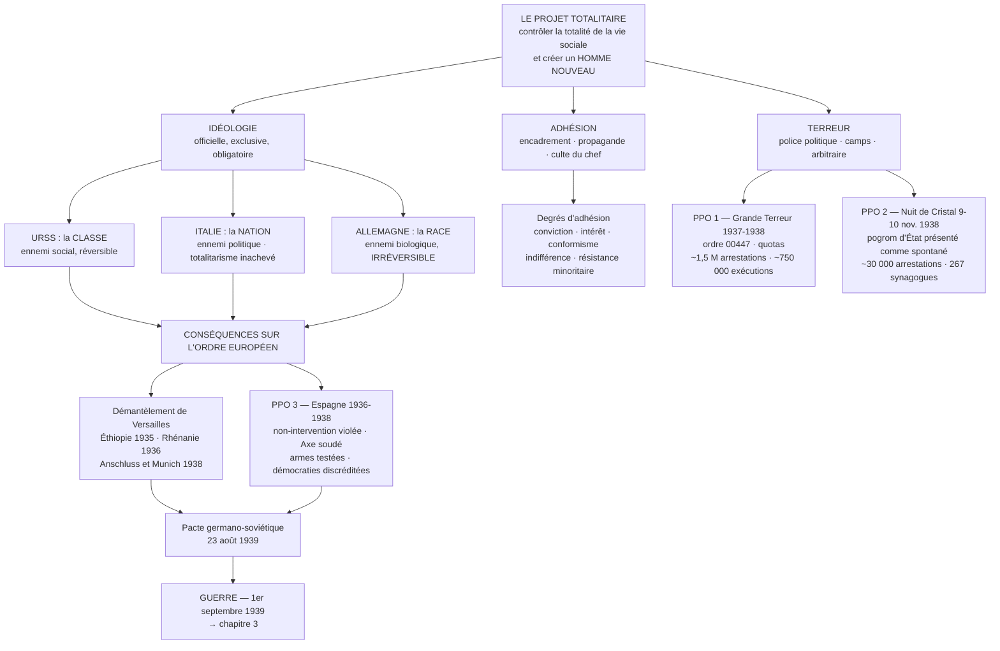

# HISTOIRE — Terminale générale (tronc commun)

## Thème 1 — Fragilités des démocraties, totalitarismes et Seconde Guerre mondiale (1929-1945)
### Chapitre 2 — Les régimes totalitaires

---

> **Cadre réglementaire.** Programme d'histoire-géographie de terminale générale, arrêté du 19 juillet 2019, BO spécial n° 8 du 25 juillet 2019 (Annexe 1). Thème 1 : 13-15 heures. Ce chapitre : **5 à 6 heures**.
>
> **Ce document est le cours.** Il contient le récit historique complet, les documents à analyser, la méthode et les évaluations corrigées. Il se suffit à lui-même : il n'y a rien à aller chercher ailleurs pour maîtriser le chapitre.

---

## SOMMAIRE

1. [Ce que dit le programme](#1--ce-que-dit-le-programme)
2. [Lexique fondamental](#2--lexique-fondamental)
3. [Introduction du cours](#3--introduction-du-cours)
4. [I. Qu'est-ce qu'un régime totalitaire ? Un concept et trois projets](#i--quest-ce-quun-régime-totalitaire--un-concept-et-trois-projets)
5. [II. Faire adhérer : idéologie, encadrement, propagande](#ii--faire-adhérer--idéologie-encadrement-propagande)
6. [III. Faire régner la terreur : la violence comme mode de gouvernement](#iii--faire-régner-la-terreur--la-violence-comme-mode-de-gouvernement)
7. [IV. Bouleverser l'ordre européen](#iv--bouleverser-lordre-européen)
8. [Conclusion](#conclusion)
9. [Schéma-bilan](#schéma-bilan)
10. [Repères chronologiques exigibles](#repères-chronologiques-exigibles)
11. [Encadré historiographique](#encadré-historiographique--un-concept-en-débat)
12. [Dossier documentaire](#dossier-documentaire)
13. [Méthode : l'analyse critique de documents](#méthode--lanalyse-critique-de-documents)
14. [ÉVALUATION 1 — Analyse critique de deux documents (corrigé rédigé)](#évaluation-1--analyse-critique-de-deux-documents)
15. [ÉVALUATION 2 — Composition (corrigé rédigé)](#évaluation-2--composition)
16. [ÉVALUATION 3 — Questions problématisées courtes (corrigé)](#évaluation-3--questions-problématisées-courtes)
17. [Erreurs fréquentes](#erreurs-fréquentes-à-ne-pas-commettre)
18. [Fiche de révision](#fiche-de-révision--lessentiel-en-une-page)
19. [Bibliographie et sitographie](#bibliographie-et-sitographie)

---

## 1 — Ce que dit le programme

**Citation textuelle du BO (Annexe 1, p. 6) :**

> **Objectifs.** « Ce chapitre vise à mettre en évidence les caractéristiques des régimes totalitaires (**idéologie, formes et degrés d'adhésion, usage de la violence et de la terreur**) et **leurs conséquences sur l'ordre européen**.
> On peut mettre en avant les caractéristiques :
> — du régime soviétique ;
> — du fascisme italien ;
> — du national-socialisme allemand. »

> **Points de passage et d'ouverture.**
> — « 1937-1938 : la Grande Terreur en URSS » ;
> — « 9-10 novembre 1938 : la nuit de Cristal » ;
> — « 1936-1938 : les interventions étrangères dans la guerre civile espagnole : géopolitique des totalitarismes ».

**La fiche ressource Éduscol (juin 2021) précise l'intention du chapitre :**

> « L'objectif de ce chapitre est de mettre en avant **les alternatives à la démocratie** que les régimes totalitaires proposent et de comprendre comment leurs projets, **de natures différentes**, engendrent des débats passionnés sur leur nature exacte. […] Ces régimes bouleversent l'ordre européen. Ils génèrent des tensions à l'intérieur des démocraties, mais également entre elles, comme le montrent les **atermoiements des opinions publiques européennes, partagées entre conciliation et fermeté** face aux politiques extérieures agressives de l'Italie ou de l'Allemagne (invasion de l'Éthiopie en 1935, remilitarisation de la Rhénanie en 1936, Anschluss et annexion des Sudètes en 1938). »

### Décodage : ce que l'intitulé impose et interdit

| Élément de l'énoncé | Conséquence pour la construction du cours |
|---|---|
| **« caractéristiques »** | Le chapitre est **comparatif et thématique**, pas monographique. On ne fait pas « I. L'URSS / II. L'Italie / III. L'Allemagne » : on fait « I. l'idéologie / II. l'adhésion / III. la terreur », en confrontant les trois cas dans chaque partie. |
| **« idéologie, formes et degrés d'adhésion, usage de la violence »** | Ce sont les **trois entrées obligatoires**, dans cet ordre logique : ce que le régime veut → comment il fait vouloir → comment il fait taire. Le mot **« degrés »** interdit de décrire des sociétés uniformément fanatisées. |
| **« conséquences sur l'ordre européen »** | Une **quatrième partie obligatoire**, géopolitique. Un devoir qui l'oublie est hors sujet pour un quart. |
| **« régimes totalitaires »** (au pluriel) | Le pluriel est un avertissement : il y a **plusieurs** totalitarismes, donc des différences irréductibles. Le chapitre doit rapprocher **et** distinguer. |

> ⚠️ **Les deux pièges signalés par Éduscol, mot pour mot :**
> — « **Traiter la naissance et plus largement le fonctionnement des régimes totalitaires.** » → On ne refait pas l'histoire de la prise du pouvoir de Mussolini (1922), Staline (1924-1929) ou Hitler (1933). Ces faits sont des **prérequis rappelés en trois lignes**, pas des développements.
> — « **Faire l'histoire de la guerre civile espagnole.** » → Le PPO porte sur les **interventions étrangères** et la **géopolitique**, pas sur les opérations militaires ni sur la politique intérieure espagnole.

---

## 2 — Lexique fondamental

> Chaque notion doit être sue **avec sa nuance**. C'est la nuance qui fait la différence entre une copie moyenne et une bonne copie.

### A. Le vocabulaire du régime

**Totalitarisme** — Système politique dans lequel un parti unique, porteur d'une idéologie officielle et exclusive, cherche à contrôler **la totalité** de la vie sociale, économique, culturelle et privée, afin de **transformer la société et l'individu lui-même**, en s'appuyant sur la mobilisation permanente des masses et sur la terreur d'État.
→ **Le mot-clé est « total » : ce qui définit le totalitarisme n'est pas la brutalité (les dictatures classiques sont brutales), mais l'ambition de ne rien laisser en dehors.**

**Autoritarisme** — Régime non démocratique qui confisque le pouvoir politique et réprime l'opposition, mais **sans projet de transformation de l'homme**, tolérant un pluralisme limité (Église, armée, notables, entreprises) et cherchant à **démobiliser** la population plutôt qu'à la mobiliser.
→ Distinction établie par le politologue **Juan Linz**. Exemples : le Portugal de Salazar, l'Espagne de Franco après 1939, les régimes latino-américains des années 1930 étudiés au chapitre 1.

| | **Autoritarisme** | **Totalitarisme** |
|---|---|---|
| Rapport à la population | La **démobiliser** : « rentrez chez vous » | La **mobiliser** en permanence : défilés, campagnes, meetings |
| Idéologie | Une « mentalité » vague (ordre, tradition, nation) | Une **idéologie totale**, systématique, obligatoire |
| Sphère privée | Largement laissée libre | **Abolie** : famille, loisirs, sport, croyances sont politiques |
| Pluralisme | Limité mais réel (Église, armée, patronat) | Aucun : tout est absorbé par le parti-État |
| Objectif ultime | Conserver le pouvoir | **Créer un homme nouveau** |

**Parti-État** — Situation dans laquelle le parti unique se confond avec l'appareil d'État : les mêmes hommes, les mêmes hiérarchies, aucune frontière entre l'administration et l'organisation politique.

**Culte de la personnalité** — Sacralisation systématique du chef, présenté comme infaillible, providentiel, et incarnant à lui seul le peuple. *Il Duce*, *der Führer*, le *Vojd* (guide) — les trois mots signifient la même chose : **le chef**.

**Führerprinzip** (« principe du chef ») — Principe d'organisation nazi selon lequel l'autorité descend du Führer par une chaîne de chefs subordonnés, chacun disposant d'un pouvoir absolu sur son échelon. **Il supprime toute délibération et tout contrôle.**

**Religion politique** — Concept de l'historien **Emilio Gentile** : le régime totalitaire sacralise la politique en lui empruntant les formes du religieux (dogme, liturgie, martyrs, reliques, calendrier sacré, hérésie, excommunication). → C'est la grille qui permet de comparer les trois régimes sans les confondre.

### B. Le vocabulaire de l'encadrement

**Embrigadement** — Encadrement obligatoire ou quasi obligatoire de la population dans des organisations de masse contrôlées par le parti, couvrant tous les âges et tous les temps de la vie.

**Propagande** — Ensemble des moyens de communication employés pour imposer une vision du monde, **non pour informer mais pour faire adhérer**. Elle se distingue de l'information par son but (agir, non renseigner) et de la publicité par son objet (le pouvoir, non le produit).

**Censure** — Contrôle préalable de tout ce qui est publié, diffusé ou représenté ; corollaire indispensable de la propagande, dont elle assure le monopole.

**Homme nouveau** — Type humain que le régime prétend engendrer : le fasciste viril et guerrier, l'Aryen racialement pur, l'*Homo sovieticus* dévoué au collectif. **Le corps devient un objet politique** (sport de masse, gymnastique, eugénisme).

**Adhésion / consentement / conformisme** — Trois degrés à ne jamais confondre. L'**adhésion** est une croyance ; le **consentement** est une acceptation passive ; le **conformisme** est une obéissance extérieure sans croyance. Les trois coexistent dans toute société totalitaire.

### C. Le vocabulaire de la violence

**Terreur d'État** — Usage systématique et **délibérément imprévisible** de la violence par l'État contre sa propre population, non pour punir des actes commis mais pour produire une **peur généralisée**. Sa force tient à son arbitraire : nul ne peut savoir s'il est en sécurité.

**Police politique** — Police secrète chargée de la surveillance et de la répression des opposants réels ou supposés : **Tcheka → Guépéou → NKVD** (URSS), **Gestapo** et **SS** (Allemagne), **OVRA** (Italie).

**Camp de concentration** — Lieu de détention extrajudiciaire où l'on enferme des personnes non pour ce qu'elles ont fait mais **pour ce qu'elles sont** (opposants, catégories sociales ou raciales désignées), sans jugement ni durée fixée. → **Goulag** en URSS (1930), **Dachau** en Allemagne (22 mars 1933).
> ⚠️ Le camp de concentration n'est **pas** le camp d'extermination. Ce dernier n'apparaît qu'en 1941-1942 : c'est l'objet du chapitre 3.

**Goulag** — Acronyme russe de « Direction principale des camps ». Désigne le système concentrationnaire soviétique, à la fois instrument de répression et **réservoir de main-d'œuvre forcée** pour l'industrialisation.

**Purge** — Élimination, au sein même du parti ou de l'appareil d'État, de membres accusés de trahison. Le totalitarisme se caractérise par le fait que **la terreur frappe aussi, et massivement, ses propres cadres**.

**Pogrom** *(du russe : « destruction »)* — Émeute meurtrière et destructrice dirigée contre une communauté, en particulier juive, généralement encouragée ou organisée par le pouvoir tout en étant présentée comme spontanée.

**Antisémitisme d'État** — Discrimination des Juifs inscrite dans la loi et appliquée par l'administration, par opposition à l'antisémitisme d'opinion. Étape décisive en Allemagne : les **lois de Nuremberg** (15 septembre 1935).

**Eugénisme** — Doctrine visant à « améliorer » biologiquement une population par la sélection des naissances : encouragement de la reproduction des « bons » éléments, stérilisation ou élimination des autres. En Allemagne, loi du 14 juillet 1933 sur la stérilisation forcée.

**Espace vital** *(Lebensraum)* — Théorie nazie selon laquelle le peuple allemand aurait besoin, pour survivre, de conquérir des territoires à l'Est aux dépens des Slaves. **C'est un programme de guerre inscrit dans l'idéologie elle-même.**

**Volksgemeinschaft** (« communauté du peuple ») — Idéal nazi d'une communauté nationale unie, débarrassée des divisions de classe **et** des éléments « étrangers à la race ». **L'inclusion des uns suppose l'exclusion des autres : c'est le même geste.**

---

## 3 — Introduction du cours

### Accroche

**Paris, été 1937.** Sur l'esplanade du Trocadéro, l'Exposition internationale des Arts et Techniques bat son plein. Deux pavillons se font face, exactement, délibérément. À gauche, le pavillon allemand conçu par Albert Speer : une tour massive surmontée d'un aigle tenant la croix gammée. À droite, le pavillon soviétique de Boris Iofan, couronné par *L'Ouvrier et la Kolkhozienne* de Vera Moukhina, deux géants d'acier lancés en avant, faucille et marteau brandis. Deux régimes qui se proclament ennemis mortels et qui, architecturalement, se ressemblent : même gigantisme, même culte de la force, même mise en scène de l'homme nouveau.

À quelques dizaines de mètres, dans le pavillon modeste de la République espagnole, est accrochée une toile immense en noir, blanc et gris. Picasso vient de la peindre en cinq semaines. Elle s'appelle *Guernica* : elle représente le bombardement, le 26 avril 1937, d'une petite ville basque par les avions allemands et italiens envoyés au secours du général Franco.

**Trois pavillons, une leçon.** Les deux totalitarismes qui se font face sur l'esplanade se combattent déjà par procuration en Espagne — et les démocraties qui les accueillent regardent.

### Rappel des prérequis *(à savoir, pas à développer)*

Les trois régimes sont **antérieurs** à la période étudiée ici :
- **Italie** : Mussolini est au pouvoir depuis la **marche sur Rome (28 octobre 1922)** ; le régime devient dictatorial avec les lois « fascistissimes » de **1925-1926**.
- **URSS** : le régime bolchevique est né de la **révolution d'Octobre 1917** ; Staline, secrétaire général du Parti depuis 1922, s'impose entre 1924 et 1929 en écartant Trotski puis Boukharine.
- **Allemagne** : Hitler est nommé chancelier le **30 janvier 1933** ; il obtient les pleins pouvoirs le **24 mars 1933** et cumule les fonctions de chancelier et de chef de l'État à la mort de Hindenburg, le **2 août 1934**.

### Délimitation

- **Bornes chronologiques** : 1922-1939, avec un cœur dans les **années 1930**, décennie où les trois régimes atteignent leur maturité et où leurs politiques extérieures s'entrechoquent.
- **Espace** : l'Europe, mais une Europe dont les tensions se jouent aussi en Éthiopie et en Espagne.
- **Objet** : non pas la naissance de ces régimes, mais **ce qu'ils sont**, **comment ils tiennent**, et **ce qu'ils font à l'Europe**.

### Problématique

> **En quoi les régimes totalitaires constituent-ils une alternative radicale à la démocratie — et par quels moyens leur volonté d'emprise totale sur les sociétés a-t-elle abouti à la destruction de l'ordre européen ?**

*(Formulations alternatives recevables : « Un même mot pour trois régimes : ce qui rapproche et ce qui sépare les totalitarismes des années 1930 » — « Comment les régimes totalitaires ont-ils cherché à contrôler les corps, les esprits et les frontières ? »)*

### Annonce du plan

Nous établirons d'abord **ce qu'est un régime totalitaire**, en confrontant le concept aux trois projets idéologiques qu'il recouvre, irréductibles les uns aux autres (I). Nous étudierons ensuite **les moyens de l'adhésion** : encadrement, propagande, culte du chef — et les degrés très inégaux de cette adhésion (II). Nous analyserons **la terreur comme mode de gouvernement**, à travers la Grande Terreur soviétique et la nuit de Cristal (III). Nous montrerons enfin **comment ces régimes ont démantelé l'ordre européen**, en particulier par leur intervention conjointe en Espagne (IV).

---

## I — Qu'est-ce qu'un régime totalitaire ? Un concept et trois projets

### A. Un mot forgé contre le fascisme, puis revendiqué par lui

L'histoire du mot est déjà une leçon d'histoire.

**1923 — l'invention par un adversaire.** L'adjectif italien *totalitario* apparaît sous la plume de **Giovanni Amendola**, journaliste et député libéral antifasciste, dans un article du quotidien *Il Mondo* du **12 mai 1923**. Amendola dénonce alors le « système totalitaire » que Mussolini met en place en réformant la loi électorale pour garantir au parti vainqueur une majorité écrasante. **Le mot naît donc comme une arme critique**, dans la bouche d'un opposant. Amendola sera roué de coups par des militants fascistes et mourra de ses blessures en 1926.

**1925 — le retournement.** Deux ans plus tard, les théoriciens du régime — au premier rang desquels le philosophe **Giovanni Gentile** — s'emparent du terme et le retournent en éloge : être « totalitaire », ce serait réaliser enfin l'unité du peuple contre les divisions du parlementarisme. Mussolini lui donne sa formule canonique, à la Scala de Milan, le **28 octobre 1925** : *« Tout dans l'État, rien en dehors de l'État, rien contre l'État. »*

**1951-1956 — l'entrée dans les sciences sociales.** Après la guerre, deux ouvrages fondent l'usage savant du concept :
- **Hannah Arendt**, *Les Origines du totalitarisme* (1951), qui voit dans le nazisme et le stalinisme un phénomène politique **inédit**, irréductible aux tyrannies classiques, reposant sur l'idéologie, la terreur et l'atomisation des individus ;
- **Carl Friedrich et Zbigniew Brzezinski**, *Totalitarian Dictatorship and Autocracy* (1956), qui proposent une définition par critères, longtemps dominante.

> 🧠 **Ce qu'il faut retenir de cette généalogie.** Un concept historique n'est jamais neutre : celui-ci a été forgé pour dénoncer, retourné pour glorifier, puis reconstruit pour analyser. **Savoir d'où vient un mot fait partie de la démarche historique.**

### B. Le « syndrome » totalitaire : six critères, appliqués

Friedrich et Brzezinski identifient **six caractéristiques** dont la réunion définit un régime totalitaire. Vérifions-les.

| Critère | **URSS stalinienne** | **Italie fasciste** | **Allemagne nazie** |
|---|---|---|---|
| **1. Une idéologie officielle et exclusive** | Marxisme-léninisme version stalinienne : lutte des classes, société sans classes | Fascisme : nation, hiérarchie, culte de l'action et de la guerre, romanité | National-socialisme : race, espace vital, antisémitisme biologique |
| **2. Un parti unique de masse dirigé par un chef** | PCUS ; Staline, secrétaire général | PNF (Parti national fasciste) ; Mussolini, *Duce* | NSDAP ; Hitler, *Führer* |
| **3. Une police politique et la terreur** | Guépéou puis **NKVD** ; Goulag ; troïkas | **OVRA** (1927) ; Tribunal spécial (1926) ; *confino* | **Gestapo**, **SS**, SD ; camps (Dachau, 1933) |
| **4. Le monopole des moyens de communication** | Glavlit (censure), *Pravda*, réalisme socialiste (1934) | Minculpop (1937), « veline », Istituto Luce | Ministère de la Propagande (Goebbels, mars 1933) |
| **5. Le monopole des armes** | Armée rouge encadrée par des commissaires politiques | **Partiel** : l'armée reste royale, fidèle au roi | Wehrmacht + armée du parti (SS), serment au Führer (1934) |
| **6. La direction centralisée de l'économie** | Planification intégrale (plans quinquennaux dès 1928) | Corporatisme, autarcie après 1935 — mais capitalisme privé maintenu | Économie dirigée, plan de quatre ans (1936), réarmement |

**Lecture du tableau.** Deux régimes cochent les six cases : l'URSS et l'Allemagne. **L'Italie n'en coche que quatre et demie**, et c'est capital pour la suite du raisonnement.

### C. Le cas italien : un totalitarisme inachevé ?

Trois limites structurelles empêchent le fascisme italien d'être « total » :

1. **La monarchie subsiste.** Victor-Emmanuel III reste roi, chef nominal de l'armée, et c'est lui qui pourra destituer Mussolini le 25 juillet 1943. **Il existe donc un pouvoir légal concurrent.**
2. **L'Église conserve son autonomie.** Les **accords du Latran (11 février 1929)** réconcilient l'État italien et la papauté : le catholicisme devient religion d'État, l'Église garde ses écoles, ses associations (l'Action catholique) et sa liberté de parole. **Une institution échappe au parti-État** — impensable en Allemagne ou en URSS.
3. **La violence reste d'une intensité incomparablement moindre en métropole.** Le Tribunal spécial pour la défense de l'État prononce environ **4 600 condamnations et 31 exécutions entre 1927 et 1943**. L'opposant est le plus souvent envoyé au *confino* (résidence surveillée dans une île ou un village reculé) plutôt qu'exécuté.

C'est pourquoi Hannah Arendt refuse de classer l'Italie parmi les totalitarismes accomplis, y voyant une dictature à parti unique. **Mais attention à ne pas basculer dans l'excès inverse** : l'historien **Emilio Gentile** a montré que le *projet* totalitaire italien était bien réel, avec sa religion politique, son homme nouveau et son ambition impériale — et il faut y ajouter une donnée souvent oubliée : **la violence coloniale italienne fut, elle, extrême**. En Libye (camps de Cyrénaïque, 1929-1933) et en Éthiopie (1935-1936, emploi de gaz de combat), elle a fait des dizaines de milliers de morts. **Le fascisme a été plus « total » hors d'Italie qu'en Italie.**

### D. Trois idéologies irréductibles : classe, nation, race

C'est le cœur intellectuel du chapitre. **Les trois régimes se ressemblent par les moyens ; ils diffèrent radicalement par la définition de l'ennemi — et donc par la nature de leur violence.**

| | **URSS** | **Italie** | **Allemagne** |
|---|---|---|---|
| **Fondement de l'idéologie** | La **classe** | La **nation** | La **race** |
| **Ennemi désigné** | Le bourgeois, le koulak, le « saboteur », l'« ennemi du peuple » | Le libéral, le socialiste, le « décadent » ; le colonisé | Le Juif, le Slave, le Tsigane, le handicapé, l'homosexuel |
| **Critère d'appartenance à l'ennemi** | **Social et politique** — donc déclaré, imputé | **Politique**, puis racial et tardif (lois raciales de 1938, sous influence allemande) | **Biologique** — donc héréditaire |
| **Peut-on cesser d'être l'ennemi ?** | **Oui, en théorie** : rééducation par le travail, autocritique, « rachat » | Oui : on peut se rallier au régime | **Non. Jamais.** On ne cesse pas d'être ce que la « race » vous a fait |
| **Utopie visée** | Société sans classes, universalisme messianique | Nation régénérée, nouvel Empire romain | Communauté raciale purifiée, espace vital à l'Est |
| **Horizon de la violence** | Éliminer une **classe** | Dominer et conquérir | **Éliminer une « race »** |

> 🔑 **Idée-force absolument centrale.** L'ennemi soviétique est défini par ce qu'il **fait** ou par sa position sociale : on peut, en principe, le « rééduquer ». L'ennemi nazi est défini par ce qu'il **est** : aucune conversion, aucune loyauté, aucun service rendu ne peut le sauver. **C'est cette différence de nature — et non une différence de degré — qui explique que seul le nazisme ait débouché sur un génocide.** Un devoir qui écrit « les deux régimes sont pareils » commet une faute historique majeure.

---

## II — Faire adhérer : idéologie, encadrement, propagande

Un régime totalitaire ne se contente pas d'obéissance : il exige **l'adhésion**, c'est-à-dire que l'individu veuille ce que le régime veut. Cette exigence gouverne tout le dispositif d'encadrement.

### A. L'idéologie comme religion politique

L'historien **Emilio Gentile** a proposé la notion de **sacralisation de la politique** : les régimes totalitaires empruntent au religieux ses formes pour capter la ferveur qu'il suscitait.

| Élément religieux | **URSS** | **Italie** | **Allemagne** |
|---|---|---|---|
| **Dogme** | Le marxisme-léninisme, « science » infaillible | *Credere, Obbedire, Combattere* (« Croire, obéir, combattre ») | *Mein Kampf*, la doctrine raciale |
| **Prophète / sauveur** | Lénine, puis Staline, « petit père des peuples » | Mussolini : « le Duce a toujours raison » | Hitler, guide providentiel du peuple allemand |
| **Reliques et sanctuaires** | Le corps embaumé de Lénine, mausolée sur la place Rouge (1924) | Exposition de la Révolution fasciste (1932) | Temples d'honneur de Munich pour les « martyrs » de 1923 |
| **Liturgie de masse** | Défilés du 1er Mai et du 7 Novembre | Rassemblements de la place de Venise | Congrès de Nuremberg, « cathédrale de lumière » |
| **Calendrier sacré** | Fêtes révolutionnaires | **Ère fasciste** : l'an I commence en 1922 | 30 janvier, 9 novembre : anniversaires du régime |
| **Salut rituel** | — | Salut romain, bras tendu | *Heil Hitler*, obligatoire dans la vie quotidienne |

**Ce que produit ce dispositif :** il transforme l'appartenance politique en **expérience émotionnelle collective**. Le citoyen ne raisonne plus, il communie. C'est exactement l'inverse de la délibération démocratique.

### B. Encadrer tous les âges et tous les temps de la vie

Le principe est simple et implacable : **il ne doit exister aucun temps ni aucun espace non contrôlé.** Ni l'enfance, ni le travail, ni les loisirs, ni le sport, ni la famille.

| | **URSS** | **Italie** | **Allemagne** |
|---|---|---|---|
| **Enfance** | Octobristes (7-9 ans), **Pionniers** (10-14 ans) | *Figli della Lupa* (4-8 ans), ***Balilla*** (8-14 ans) | *Deutsches Jungvolk* (10-14 ans) |
| **Adolescence / jeunesse** | **Komsomol** (14-28 ans) | *Avanguardisti*, puis **GIL** (1937) | **Hitlerjugend** (garçons), **BDM** (filles) — obligatoire en 1939 |
| **Travail** | Syndicats intégrés à l'État ; **stakhanovisme** (1935) | Corporations ; Charte du travail (1927) | Syndicats dissous le 2 mai 1933 → **DAF** (Front du travail) ; **RAD** (service du travail, 1935) |
| **Loisirs** | Maisons de la culture, sport de masse, parcs « de culture et de repos » | ***Dopolavoro*** (OND, 1925) : sport, colonies, spectacles | ***Kraft durch Freude*** (« La force par la joie ») : croisières, voyages, projet Volkswagen |
| **Femmes** | Travail féminin encouragé (besoins de l'industrialisation), mais retour à un ordre familial conservateur après 1936 (avortement réinterdit) | Mère prolifique, « bataille des naissances » (1927) | *Kinder, Küche, Kirche* ; croix d'honneur de la mère allemande (1938) |
| **Art officiel** | **Réalisme socialiste** (imposé en 1934) | Monumentalisme romain | Art « aryen » ; exposition de l'« art dégénéré » (1937) |

**Un exemple à savoir raconter : le stakhanovisme.** Le 31 août 1935, le mineur **Alexeï Stakhanov** aurait extrait 102 tonnes de charbon en une seule nuit, soit quatorze fois la norme. L'exploit — organisé, préparé, aidé par une équipe entière — est transformé en mythe national. Il sert à **imposer de nouvelles normes de production à tous les ouvriers** sous couvert d'émulation volontaire. **La propagande n'est pas seulement du discours : c'est un instrument de gestion de la main-d'œuvre.**

### C. Le monopole de l'information

**En Allemagne**, Joseph **Goebbels** dirige dès mars 1933 le ministère de l'Éducation du peuple et de la Propagande. Trois leviers :
- la **radio** : diffusion massive du *Volksempfänger*, récepteur bon marché conçu pour capter les émissions allemandes et non les stations étrangères. **La technologie est pensée politiquement.**
- le **livre** : autodafés du **10 mai 1933** ; des milliers d'ouvrages « non allemands » brûlés publiquement par des étudiants sur la Bebelplatz de Berlin.
- le **cinéma** : *Le Triomphe de la volonté* de **Leni Riefenstahl** (1935), film du congrès de Nuremberg de 1934, chef-d'œuvre technique entièrement au service de la sacralisation du chef.

**En URSS**, outre la censure (Glavlit) et le monopole de la *Pravda*, le régime pratique la **falsification systématique des images**. Les dirigeants tombés en disgrâce sont effacés des photographies officielles — le cas le plus célèbre est celui de **Nikolaï Iejov**, chef du NKVD, effacé après son exécution d'un cliché où il marchait aux côtés de Staline. **Le régime ne se contente pas de contrôler le présent : il réécrit le passé.**

**En Italie**, le Minculpop (ministère de la Culture populaire, 1937) envoie chaque jour aux journaux les *veline*, consignes précisant ce qu'il faut écrire, taire, et sur quel ton.

**Un cas d'école : les Jeux olympiques de Berlin (août 1936).** Le régime nazi met temporairement en sourdine l'antisémitisme visible — retrait des pancartes, tolérance de façade — pour offrir au monde l'image d'une Allemagne moderne et pacifique. **L'opération réussit.** Elle montre que la propagande totalitaire ne s'adresse pas seulement à sa propre population : elle vise aussi **l'opinion internationale**, qu'elle cherche à désarmer.

### D. Les degrés réels de l'adhésion — la nuance décisive

Le programme dit **« formes et degrés d'adhésion »**. Ce pluriel interdit l'image d'une société uniformément fanatisée. La réalité est un dégradé :

1. **L'adhésion sincère.** Réelle et massive, surtout chez les jeunes formés par le régime, et chez ceux à qui il a apporté quelque chose : promotion sociale, emploi, fierté nationale. En Allemagne, la baisse du chômage après 1933 achète beaucoup de loyauté. En URSS, les *vydvijentsy* — ouvriers promus cadres pendant les années 1930 — doivent tout au système.
2. **L'adhésion intéressée.** Prendre sa carte pour obtenir un poste, un logement, une place à l'université. En Italie, la carte du PNF est surnommée « la carte du pain ».
3. **Le conformisme par peur.** Faire le salut, applaudir, dénoncer si nécessaire, sans y croire.
4. **L'indifférence et le retrait.** L'« exil intérieur » : se taire, se replier sur la famille, tenter de traverser.
5. **La résistance.** Minoritaire, isolée, durement réprimée. En Italie, les antifascistes sont emprisonnés (**Antonio Gramsci**, incarcéré de 1926 à sa mort en 1937) ou assassinés en exil (les frères **Rosselli**, tués en France le 9 juin 1937). En Allemagne, l'**Église confessante** (déclaration de Barmen, 1934) refuse la mise au pas religieuse. En URSS, toute opposition organisée est devenue matériellement impossible.

> 🔑 **Le fait le plus contre-intuitif du chapitre, et le plus important.** La **Gestapo** ne comptait que quelques milliers d'agents pour plus de soixante millions d'Allemands. Un tel appareil ne pouvait surveiller personne. **Il a fonctionné grâce aux dénonciations spontanées de la population** — voisins, collègues, parfois membres de la famille, souvent pour des motifs privés (rivalités, jalousies, héritages). **Le régime totalitaire ne tient pas seulement par la police : il tient parce qu'une partie de la société accepte de faire le travail de la police.** C'est ce constat qui rend le phénomène si troublant — et si nécessaire à comprendre.

---

## III — Faire régner la terreur : la violence comme mode de gouvernement

### A. La terreur n'est pas un dérapage : c'est un instrument

Dans une dictature ordinaire, la répression punit des opposants. Dans un régime totalitaire, **la terreur frappe au-delà des opposants, y compris des innocents, et y compris au sein du parti.** Cet arbitraire n'est pas un défaut du système : c'en est le principe. En rendant impossible de savoir ce qui protège, il produit une soumission généralisée.

Trois instruments :
- **la police politique** (NKVD, Gestapo/SS, OVRA), au-dessus des lois ;
- **la justice d'exception** : troïkas soviétiques (trois hommes, aucun avocat, aucun appel), Tribunal du peuple allemand (1934), Tribunal spécial italien (1926) ;
- **le camp**, lieu d'enfermement sans jugement ni terme : Goulag (1930), Dachau (22 mars 1933).

**Ordres de grandeur à comparer** *(exercice d'histoire, non hiérarchie morale)* :

| | Italie fasciste | Allemagne nazie (avant-guerre) | URSS stalinienne |
|---|---|---|---|
| Exécutions politiques | ~31 (Tribunal spécial, 1927-1943) | Milliers (dont ~85-200 lors de la Nuit des Longs Couteaux, juin 1934) | **~750 000 en seize mois (1937-1938)** |
| Détenus | Quelques milliers (prison, *confino*) | ~25 000 en camp en 1939 | **~1,7 million au Goulag en 1939** |

### 🔍 PPO 1 — 1937-1938 : la Grande Terreur en URSS

> **Ce que ce point de passage doit démontrer :** que la terreur de masse stalinienne n'est ni un chaos, ni une dérive incontrôlée, mais une **opération planifiée, chiffrée et administrée**, décidée au sommet et arrêtée sur ordre.

**1. Le contexte.** L'assassinat de **Sergueï Kirov**, dirigeant du parti à Leningrad, le **1er décembre 1934**, fournit le prétexte d'un durcissement continu. Staline, qui vient de faire adopter une Constitution présentée comme « la plus démocratique du monde » (1936), dénonce la persistance d'« ennemis du peuple » infiltrés partout.

**2. La face visible : les procès de Moscou.** Trois grands procès publics, filmés et abondamment relayés, éliminent les compagnons de Lénine :
- **août 1936** : Zinoviev et Kamenev ;
- **janvier 1937** : Piatakov et Radek ;
- **mars 1938** : Boukharine et Rykov.
Les accusés **avouent des crimes imaginaires** — espionnage, sabotage, complot trotskiste — au terme d'interrogatoires prolongés, de tortures et de chantage sur leurs familles. Ils sont exécutés.
S'y ajoute l'**épuration de l'Armée rouge** : le maréchal **Toukhatchevski** est fusillé en juin 1937 ; trois maréchaux sur cinq et l'immense majorité des commandants d'armée disparaissent. **L'URSS décapite son commandement militaire deux ans avant la guerre.**

**3. La face cachée : les opérations de masse.** C'est la découverte majeure permise par l'ouverture partielle des archives soviétiques en **1992**. Les procès n'étaient que la vitrine.

L'**ordre opérationnel n° 00447 du NKVD, du 30 juillet 1937**, dit « opération koulak », organise l'arrestation méthodique des « ex-koulaks, criminels et autres éléments antisoviétiques ». Son mécanisme :
- les personnes visées sont réparties en **deux catégories** : la **1re catégorie** est fusillée, la **2e catégorie** envoyée au camp pour huit à dix ans ;
- des **quotas chiffrés sont fixés région par région** : initialement environ **269 000 arrestations, dont 76 000 exécutions** ;
- le jugement est confié à des **troïkas** régionales expédiant des dizaines de dossiers par séance ;
- les chefs régionaux doivent **rendre compte tous les cinq jours** du nombre d'arrêtés, de condamnés et de fusillés ;
- les régions **demandent et obtiennent des relèvements de quotas**, par zèle ou par peur.

À ces opérations s'ajoutent les **« opérations nationales »**, visant des minorités soupçonnées de déloyauté (ordre n° 00485 contre les Polonais, opérations allemande, lettone, coréenne…) : plus de **335 000 arrestations**, avec un taux d'exécution de **73,6 %** — les Polonais paient le tribut le plus lourd, avec environ 140 000 arrestations.

**4. Le bilan.** Pour l'ensemble de la Grande Terreur, d'août 1937 à novembre 1938, l'historien **Nicolas Werth** retient, à partir des registres du NKVD :

> **~1,5 million d'arrestations · ~750 000 exécutions en seize mois.**
> Soit **un citoyen soviétique sur cent arrêté, un sur deux cents fusillé** — environ 1 500 exécutions par jour.

Pour l'opération 00447 seule : environ **767 000 condamnations et 387 000 exécutions**, soit trois à cinq fois les quotas initiaux.

**5. L'arrêt, aussi brutal que le début.** Le **17 novembre 1938**, une directive secrète signée par Staline met fin aux opérations de masse. **Nikolaï Iejov**, chef du NKVD qui a donné son nom à la période (*Iejovchtchina*), est écarté, arrêté, puis fusillé en 1940 ; **Beria** lui succède. Le régime désigne ainsi un coupable pour les « excès » qu'il a lui-même ordonnés.

> 🔑 **Ce que ce PPO démontre.** La terreur commence sur un ordre et s'arrête sur un ordre. Elle a une administration, des formulaires, des statistiques et des objectifs chiffrés. **C'est une politique publique de mise à mort.** Elle vise des catégories sociales et nationales définies par le pouvoir, et non des actes réellement commis.

### 🔍 PPO 2 — 9-10 novembre 1938 : la nuit de Cristal

> **Ce que ce point de passage doit démontrer :** le basculement de la **discrimination légale** à la **violence physique de masse organisée par l'État**, en temps de paix, au vu de tous.

**1. Une escalade méthodique depuis 1933.** La nuit de Cristal n'est pas un commencement, mais l'aboutissement d'une progression :
- **1er avril 1933** : boycott national des commerces juifs ;
- **7 avril 1933** : exclusion des Juifs de la fonction publique ;
- **15 septembre 1935** : **lois de Nuremberg** — la loi sur la citoyenneté du Reich retire aux Juifs la citoyenneté allemande (ils deviennent de simples « ressortissants ») ; la loi « pour la protection du sang allemand » interdit les mariages et les relations entre Juifs et « citoyens de sang allemand ». **L'antisémitisme devient un droit de l'État** ;
- **1938** : « aryanisation » — spoliation organisée des entreprises et des biens juifs ; ajout obligatoire des prénoms « Israël » et « Sara » ; tampon « J » sur les passeports ;
- **28-29 octobre 1938** : environ 17 000 Juifs d'origine polonaise sont expulsés d'Allemagne et abandonnés à la frontière, à Zbąszyń.

**2. Le prétexte.** Parmi ces expulsés se trouvent les parents d'**Herschel Grynszpan**, jeune Juif polonais de 17 ans réfugié à Paris. Le **7 novembre 1938**, il tire sur **Ernst vom Rath**, secrétaire de l'ambassade d'Allemagne à Paris. Le diplomate meurt le **9 novembre**.

**3. Un pogrom organisé, présenté comme spontané.** Le soir même, à Munich, les cadres du parti sont réunis pour l'anniversaire du putsch de 1923. Goebbels prononce un discours incendiaire. Dans la nuit, **Reinhard Heydrich** adresse aux services de police des instructions précises : ne pas entraver les « manifestations », protéger les biens allemands voisins des incendies, arrêter autant de Juifs — « en particulier des hommes aisés » — que les prisons peuvent en contenir.

> 🔎 **Point de méthode capital.** Le régime organise le pogrom **tout en exigeant qu'il paraisse spontané**. C'est un mensonge d'État documenté par les ordres du régime lui-même. L'écart entre la version officielle (« la juste colère du peuple allemand ») et les instructions internes est **le cœur de l'analyse critique de ce PPO**.

**4. Le bilan.** Dans toute l'Allemagne, y compris l'Autriche annexée et les Sudètes :
- **267 synagogues détruites** selon le décompte retenu par l'historien Saul Friedländer et le Mémorial de la Shoah ; d'autres recensements, incluant les salles de prière saccagées, avancent des chiffres bien supérieurs — le Mémorial américain de l'Holocauste évoque plus de 1 400 lieux de culte touchés ;
- environ **7 500 commerces et entreprises juifs** saccagés et pillés ;
- **91 morts** selon le décompte officiel — un chiffre très inférieur à la réalité, qui ne compte ni les suicides, ni ceux qui succombent aux sévices ou meurent en camp dans les semaines suivantes ; les estimations postérieures vont de plusieurs centaines à un ou deux milliers ;
- **environ 30 000 hommes juifs arrêtés** et internés à **Dachau, Buchenwald et Sachsenhausen** — non pour un acte, mais pour ce qu'ils sont. La plupart sont libérés entre novembre 1938 et le printemps 1939 **à condition de s'engager à émigrer en abandonnant leurs biens**.

**5. Les suites immédiates : la spoliation érigée en punition.** Le **12 novembre 1938**, la communauté juive allemande se voit imposer une **amende collective d'un milliard de Reichsmarks** pour avoir « provoqué la colère du peuple allemand ». Elle est prélevée sur les avoirs juifs déjà bloqués. Suivent l'exclusion totale de la vie économique, l'interdiction des écoles publiques, des théâtres, des parcs.

**6. Réactions.** À l'intérieur, la population est **majoritairement spectatrice** : peu de participation active, peu de protestations, un silence quasi général des Églises. À l'extérieur, l'indignation est réelle — les États-Unis rappellent leur ambassadeur — mais **sans aucune conséquence diplomatique**. Il faut se souvenir que la conférence d'**Évian** (juillet 1938), convoquée pour organiser l'accueil des réfugiés juifs, s'était soldée par un échec : presque aucun pays n'avait accepté d'ouvrir ses portes.

> 🔑 **Ce que ce PPO démontre.** Trois seuils sont franchis en une nuit : la violence passe **du texte de loi à la rue** ; elle est **assumée publiquement** par l'État ; et elle vise **une population entière** identifiée par sa naissance. La nuit de Cristal est une étape décisive du processus qui conduira au génocide.
> ⚠️ **Mais attention à ne pas anticiper.** En novembre 1938, l'objectif nazi est encore l'**expulsion** des Juifs d'Allemagne, non leur extermination. Le passage à l'extermination systématique relève de la guerre et se traitera au **chapitre 3**. Écrire que la nuit de Cristal « commence la Shoah » est une erreur de raisonnement : c'est confondre un jalon et une programmation.

### C. Comparer les violences sans les confondre

| | **URSS (Grande Terreur)** | **Allemagne (nuit de Cristal)** |
|---|---|---|
| **Cible** | Catégories **sociales et nationales** désignées par le pouvoir | Une population définie **biologiquement** |
| **Mode opératoire** | Secret, bureaucratique, sur quotas | **Public**, spectaculaire, dans la rue |
| **Auteurs** | Une police d'État spécialisée (NKVD) | Militants du parti (SA, SS, HJ) **et civils ordinaires** |
| **Ampleur immédiate** | ~750 000 morts en 16 mois | Des dizaines à des centaines de morts, 30 000 arrestations |
| **Statut de la victime** | Réversible en principe (rééducation, « rachat ») | **Irréversible** |
| **Horizon** | Purger la société pour bâtir le communisme | Expulser, puis — à partir de 1941 — exterminer |

> 🔑 **Formule à retenir.** L'URSS tue **beaucoup plus** dans ces seize mois ; l'Allemagne engage un processus d'une **nature différente**. Comparer, en histoire, ce n'est pas classer les crimes : c'est identifier des logiques.

---

## IV — Bouleverser l'ordre européen

### A. Le démantèlement méthodique de l'ordre de Versailles (1933-1939)

L'ordre européen issu du traité de Versailles (1919) reposait sur trois piliers : les frontières fixées en 1919, le désarmement allemand, et la Société des Nations (SDN) comme instance de sécurité collective. **Les trois sont détruits en six ans**, selon une logique d'engrenage : chaque coup de force non sanctionné rend le suivant possible.

| Date | Coup de force | Réaction des démocraties |
|---|---|---|
| **Octobre 1933** | L'Allemagne quitte la SDN et la conférence du désarmement | Aucune |
| **16 mars 1935** | Rétablissement du service militaire obligatoire en Allemagne (violation directe de Versailles) | Protestations verbales ; le Royaume-Uni signe en juin un **accord naval** avec Berlin, entérinant le réarmement |
| **Octobre 1935 – mai 1936** | **Invasion de l'Éthiopie** par l'Italie ; emploi de gaz de combat | Sanctions économiques de la SDN, incomplètes et vite levées → **discrédit définitif de la SDN**, et Mussolini se rapproche de Hitler |
| **7 mars 1936** | **Remilitarisation de la Rhénanie** | Aucune. Or l'armée allemande avait ordre de se replier en cas de réaction française : **un coup de bluff réussi** |
| **1er novembre 1936** | Proclamation de l'**Axe Rome-Berlin** ; puis pacte antikomintern avec le Japon (25 nov. 1936), rejoint par l'Italie en 1937 | Constat d'impuissance |
| **12-13 mars 1938** | **Anschluss** : annexion de l'Autriche | Aucune |
| **29-30 septembre 1938** | **Accords de Munich** : la France et le Royaume-Uni livrent les Sudètes tchécoslovaques | **Soulagement des opinions publiques** ; Daladier et Chamberlain acclamés à leur retour |
| **15 mars 1939** | Démembrement de la Tchécoslovaquie — cette fois sans le moindre prétexte national | **Rupture** : garanties données à la Pologne, réarmement accéléré |
| **23 août 1939** | **Pacte germano-soviétique** et son protocole secret de partage de l'Europe orientale | Stupeur ; la guerre devient inévitable |

### 🔍 PPO 3 — 1936-1938 : les interventions étrangères dans la guerre civile espagnole

> ⚠️ **Rappel du piège Éduscol :** « **Faire l'histoire de la guerre civile espagnole.** » Le sujet n'est pas la guerre, mais **la géopolitique des totalitarismes** : pourquoi et comment l'Espagne devient le champ clos de l'Europe.

**1. Le contexte, en cinq lignes.** En février 1936, le *Frente Popular* remporte les élections espagnoles. Le **17-18 juillet 1936**, une partie de l'armée se soulève ; le *pronunciamiento* échoue à moitié et coupe le pays en deux. **Or ce putsch n'aurait pas pu réussir sans l'étranger** : l'Armée d'Afrique de Franco est bloquée au Maroc, la flotte étant restée républicaine. Ce sont les **avions de transport allemands et italiens** qui, dès juillet-août 1936, l'acheminent vers l'Andalousie. **L'intervention étrangère n'est pas une conséquence du conflit : elle en est une condition initiale.**

**2. La non-intervention, ou l'impuissance organisée.** Le gouvernement français de **Léon Blum**, pourtant issu du Front populaire et sympathisant de la République espagnole, est déchiré : soutenir Madrid risque de provoquer la guerre et de rompre avec Londres, qui refuse tout engagement. Blum propose donc un accord de **non-intervention**, dont un comité siège à Londres à partir de septembre 1936 ; une vingtaine d'États le signent.

> 🔑 **Le paradoxe décisif.** L'Allemagne, l'Italie et l'URSS **signent** l'accord de non-intervention — et le **violent** toutes les trois. La France et le Royaume-Uni le respectent. **Un accord qui n'engage que ceux qui l'appliquent désavantage mécaniquement les démocraties.** C'est la démonstration en grandeur réelle de l'impasse de la sécurité collective dans les années 1930.

**3. Qui intervient, avec quoi, et pourquoi.**

| | **Allemagne nazie** | **Italie fasciste** | **URSS** | **Brigades internationales** |
|---|---|---|---|---|
| **Camp soutenu** | Nationalistes (Franco) | Nationalistes (Franco) | République | République |
| **Forme** | **Légion Condor** : aviation, blindés, transmissions | **Corpo Truppe Volontarie** : corps expéditionnaire terrestre | Matériel (chars, avions), conseillers militaires, agents du NKVD | Volontaires civils encadrés par le Komintern |
| **Ordre de grandeur** | Quelques milliers d'hommes en permanence ; ~19 000 au total par rotation | Le contingent le plus nombreux : **jusqu'à ~50 000 hommes**, ~700 avions, ~950 chars | Livraisons **payées** par l'or de la Banque d'Espagne (transféré à Moscou dès octobre 1936) | **~35 000 volontaires** venus d'une cinquantaine de pays |
| **Objectifs** | **Tester** matériels et doctrines ; sécuriser l'accès aux minerais espagnols ; **encercler la France** | Hégémonie en Méditerranée (*mare nostrum*) ; prestige du Duce | Éviter un troisième État fasciste aux frontières françaises ; crédibiliser la stratégie des Fronts populaires antifascistes | Combattre le fascisme : engagement militant et antifasciste |

> ⚠️ **Prudence sur les chiffres.** Les effectifs varient d'une source à l'autre selon qu'on compte les présents à un instant donné ou le total des hommes passés par le théâtre d'opérations. **Retenez les ordres de grandeur et la hiérarchie** (Italie ≫ Allemagne en effectifs terrestres ; Allemagne décisive par l'aviation), et signalez l'incertitude : c'est une marque de rigueur, pas d'ignorance.

**4. Guernica, 26 avril 1937 : le laboratoire de la guerre à venir.** Un jour de marché, la Légion Condor allemande, appuyée par l'aviation italienne, bombarde et incendie la petite ville basque de Guernica, sans objectif militaire décisif. Le bilan humain est disputé — de quelques centaines à plus de 1 600 morts selon les sources, chaque camp ayant intérêt à gonfler ou minorer le chiffre. **Mais la signification ne dépend pas du décompte** : c'est l'un des premiers **bombardements de terreur délibérés contre une population civile européenne**, et il fonctionne comme un **essai en vraie grandeur** des tactiques de la Seconde Guerre mondiale. **Picasso** peint *Guernica* en quelques semaines ; l'œuvre est exposée au pavillon de la République espagnole à l'Exposition internationale de Paris en juillet 1937. **L'art devient une arme du conflit.**

**5. La face cachée : l'URSS exporte aussi sa terreur.** Dans le camp républicain, les agents soviétiques imposent leur contrôle et liquident leurs rivaux de gauche : le **POUM** est écrasé à Barcelone en mai 1937, son dirigeant Andreu Nin enlevé et assassiné. L'écrivain **George Orwell**, engagé volontaire, en tire *Hommage à la Catalogne* (1938), qui décrit de l'intérieur la mécanique du mensonge politique — et qui nourrira *1984*. **La guerre d'Espagne n'oppose donc pas simplement le fascisme à la démocratie : elle est aussi le lieu où le stalinisme montre son vrai visage à une génération d'antifascistes.**

**6. Le bilan géopolitique — l'essentiel du PPO.**
1. **L'Axe se soude** : la coopération militaire en Espagne scelle le rapprochement Rome-Berlin (novembre 1936) et arrime définitivement Mussolini à Hitler.
2. **Les armes et les doctrines sont testées** : aviation d'assaut, bombardement de terreur, coordination chars-avions.
3. **L'impuissance des démocraties est publiquement démontrée** — leçon que Hitler applique aussitôt à l'Autriche et aux Sudètes.
4. **Les opinions publiques européennes se fracturent** : l'Espagne devient le grand sujet de division politique et morale en France comme au Royaume-Uni.
5. **Franco l'emporte le 1er avril 1939** ; la ***Retirada*** jette sur les routes de France quelque **475 000 réfugiés** espagnols, souvent internés dans des camps du Sud-Ouest.

### C. Les démocraties entre conciliation et fermeté

Pourquoi les démocraties n'ont-elles pas réagi ? Il faut cinq raisons, et refuser l'explication paresseuse par la seule lâcheté :

1. **Le traumatisme de 1914-1918.** Les opinions publiques sont profondément pacifistes : la France a perdu 1,4 million d'hommes. Tout est préférable à une nouvelle guerre.
2. **Le retard militaire.** Le réarmement britannique et français est en cours mais non achevé ; gagner du temps est un calcul, pas seulement une faiblesse.
3. **Les séquelles de la crise économique.** Budgets contraints, priorités sociales, sociétés divisées : c'est le lien direct avec le **chapitre 1**.
4. **La priorité impériale.** Le Royaume-Uni pense d'abord à son Empire et redoute un conflit sur trois fronts (Allemagne, Italie, Japon).
5. **L'anticommunisme.** Une partie des élites conservatrices voit l'Allemagne comme un **rempart contre l'URSS** et redoute davantage Moscou que Berlin. Ce facteur explique l'exclusion de l'URSS des accords de Munich — humiliation dont Staline tirera les conséquences.

**Munich (29-30 septembre 1938)** est le point culminant de cette politique dite d'*appeasement* (apaisement) : la France et le Royaume-Uni acceptent l'annexion des Sudètes sans consulter la Tchécoslovaquie. Les opinions accueillent l'accord avec **soulagement**. Une minorité proteste. La formule célèbre — « vous avez choisi le déshonneur pour éviter la guerre, vous aurez le déshonneur **et** la guerre » — est traditionnellement attribuée à Churchill, mais **son attribution exacte est discutée par les historiens** ; à citer, donc, avec cette précaution.

**Le pacte germano-soviétique (23 août 1939)** referme la séquence de la façon la plus spectaculaire : les deux régimes qui se présentaient comme ennemis absolus signent un pacte de non-agression assorti d'un **protocole secret** partageant la Pologne et l'Europe orientale. **Leçon majeure : quand les intérêts de puissance convergent, l'idéologie s'efface.** Une semaine plus tard, le 1er septembre 1939, la Wehrmacht envahit la Pologne.

---

## Conclusion

**Réponse à la problématique.** Les trois régimes étudiés partagent une même ambition inédite dans l'histoire : ne rien laisser hors du contrôle du pouvoir, et refaire l'homme lui-même. De là leur famille de moyens — parti unique, idéologie obligatoire, embrigadement de tous les âges, monopole de l'information, culte du chef, terreur d'État. C'est cette parenté de méthode qui justifie le concept de totalitarisme, **à condition de l'employer comme un outil de comparaison et jamais comme un signe d'égalité**.

Car ce qui les sépare est décisif : **l'ennemi soviétique est défini par sa classe, l'ennemi nazi par sa naissance**. Le premier peut, en principe, être rééduqué ; le second ne peut être que retranché. La Grande Terreur tue plus vite et plus massivement, sur quotas, en secret ; la nuit de Cristal tue moins, mais publiquement, et engage un processus dont la logique est l'élimination. Quant à l'Italie fasciste, son projet totalitaire est réel mais buté sur la monarchie, l'Église et l'armée — ce qui n'a nullement empêché sa violence coloniale d'être extrême.

**Leur conséquence commune est géopolitique** : en six ans, ces régimes ont démantelé l'ordre européen issu de 1919, pièce par pièce, en profitant de la division, du pacifisme et du calcul des démocraties. L'Espagne fut le laboratoire de cette entreprise ; Munich en fut la consécration ; le pacte germano-soviétique en fut l'aboutissement cynique. **La guerre qui éclate en septembre 1939 n'est donc pas un accident : elle est l'aboutissement d'une décennie de coups de force acceptés.**

**Ouverture.** Le **chapitre 3** étudiera ce que cette guerre a déchaîné : un conflit d'une étendue et d'une violence sans précédent, au terme duquel l'idéologie raciale nazie conduira au génocide des Juifs d'Europe.

**Ouverture longue et exigence critique.** Le mot « totalitaire » est aujourd'hui employé à tort et à travers dans le débat public, souvent pour disqualifier un adversaire. L'histoire en donne une définition précise et lourde : parti unique, idéologie obligatoire, terreur d'État, abolition de la sphère privée. **Savoir ce que le mot veut dire, c'est aussi savoir quand il ne s'applique pas.** C'est l'un des services que l'histoire rend à la vie civique.

---

## Schéma-bilan

*(Version texte : le projet totalitaire — contrôler la totalité de la vie et refaire l'homme — se déploie par trois moyens communs : idéologie, adhésion organisée, terreur. Mais il repose sur trois idéologies incompatibles : la classe en URSS, la nation en Italie, la race en Allemagne — cette dernière seule définissant un ennemi irréversible. La terreur prend deux visages exemplaires : la Grande Terreur soviétique, secrète et sur quotas ; la nuit de Cristal, publique et raciale. Ces régimes détruisent alors l'ordre européen : démantèlement de Versailles, guerre d'Espagne comme laboratoire, Munich comme capitulation, pacte germano-soviétique comme dernier renversement — puis la guerre.)*

---

## Repères chronologiques exigibles

| Date | Événement | Pourquoi c'est un repère |
|---|---|---|
| **12 mai 1923** | Amendola forge le mot *totalitario* | Le concept naît **contre** le fascisme |
| **28 octobre 1925** | Mussolini : « Tout dans l'État, rien en dehors de l'État » | Le régime revendique le mot |
| **11 février 1929** | Accords du Latran | Limite structurelle du totalitarisme italien |
| **22 mars 1933** | Ouverture de **Dachau** | Le camp comme institution du régime nazi |
| **10 mai 1933** | Autodafés de Berlin | Monopole nazi sur la culture |
| **30 juin 1934** | Nuit des Longs Couteaux | La terreur frappe **à l'intérieur** du parti |
| **1er décembre 1934** | Assassinat de Kirov | Prétexte du durcissement soviétique |
| **15 septembre 1935** | **Lois de Nuremberg** | L'antisémitisme devient droit d'État |
| **Oct. 1935 – mai 1936** | Guerre d'Éthiopie | Faillite de la SDN, rapprochement Rome-Berlin |
| **7 mars 1936** | Remilitarisation de la Rhénanie | Coup de bluff non sanctionné |
| **Août 1936** | Jeux olympiques de Berlin | La propagande vise l'opinion **internationale** |
| **Juillet 1936 – avril 1939** | Guerre d'Espagne | Champ clos des totalitarismes |
| **1er novembre 1936** | **Axe Rome-Berlin** | Alliance des deux fascismes |
| **26 avril 1937** | **Guernica** | Premier grand bombardement de terreur en Europe |
| **30 juillet 1937** | **Ordre n° 00447 du NKVD** | La terreur de masse sur quotas |
| **1937-1938** | **Grande Terreur** : ~1,5 M d'arrestations, ~750 000 exécutions | PPO 1 |
| **12-13 mars 1938** | **Anschluss** | Versailles démantelé |
| **29-30 septembre 1938** | **Accords de Munich** | Sommet de la politique d'apaisement |
| **9-10 novembre 1938** | **Nuit de Cristal** | PPO 2 — de la loi à la violence de masse |
| **17 novembre 1938** | Directive secrète arrêtant les opérations de masse en URSS | La terreur s'arrête sur ordre |
| **23 août 1939** | **Pacte germano-soviétique** | L'idéologie cède devant la puissance |

---

## Encadré historiographique — un concept en débat

Le programme demande de comprendre que ces régimes « engendrent des débats passionnés sur leur nature exacte ». Voici l'état de ces débats — matière idéale pour une conclusion ou une ouverture.

**1. La thèse classique : un phénomène politique inédit.**
**Hannah Arendt** (*Les Origines du totalitarisme*, 1951) soutient que le nazisme et le stalinisme ne sont pas des tyrannies renforcées mais une **espèce nouvelle** : ils reposent sur une idéologie prétendant expliquer toute l'histoire, sur une terreur qui frappe des innocents par principe, et sur l'**atomisation** des individus, privés de tout lien social autonome. Arendt exclut d'ailleurs l'Italie fasciste du totalitarisme accompli.
**Friedrich et Brzezinski** (1956) en donnent la version opératoire : les six critères vus plus haut.

**2. La critique politique : un concept de guerre froide ?**
Le succès du mot dans les années 1950 tient aussi à son utilité stratégique : assimiler l'URSS au régime que l'on venait d'abattre légitimait la lutte anticommuniste. **Enzo Traverso** a analysé cette instrumentalisation. Objection sérieuse — mais qui ne suffit pas à invalider le concept : **l'origine polémique d'un outil ne dit rien de sa valeur analytique.**

**3. La critique interne : l'État nazi n'était pas monolithique.**
L'école dite **fonctionnaliste** (Martin Broszat, Hans Mommsen, **Ian Kershaw**) a montré que le IIIe Reich était en réalité une **polycratie** : un enchevêtrement d'administrations rivales se disputant l'accès au Führer, et non une machine parfaitement ordonnée. Kershaw a forgé la formule décisive : les subordonnés « travaillaient en direction du Führer », c'est-à-dire **anticipaient ses volontés supposées** pour se distinguer. **La radicalisation ne descend donc pas seulement d'en haut : elle monte aussi d'en bas.**

**4. La critique sociale : la société n'était pas seulement victime.**
Les historiens dits **révisionnistes** de l'URSS (Sheila Fitzpatrick, J. A. Getty) ont insisté sur les dynamiques venues de la société : promotions sociales, dénonciations intéressées, adhésions calculées. Même constat pour l'Allemagne, où la Gestapo dépendait des délations. **Cette approche complète la vision d'en haut ; elle ne la remplace pas** — l'ordre 00447 rappelle que les grandes opérations meurtrières ont bien été décidées au sommet.

**5. La question de la singularité : le *Historikerstreit*.**
En 1986-1987, une violente controverse oppose en Allemagne **Ernst Nolte**, qui présentait le crime nazi comme une réaction au « goulag » bolchevique, et **Jürgen Habermas**, qui y voyait une entreprise de relativisation. Le débat a tranché en faveur d'une position devenue majoritaire : **on peut comparer sans assimiler, et le génocide des Juifs conserve une singularité** — celle d'un projet d'anéantissement total d'un peuple, fondé sur un critère biologique, mené avec les moyens d'un État moderne.

**6. La synthèse la plus utile aujourd'hui.**
**Emilio Gentile** propose de saisir les trois régimes par la **sacralisation de la politique** : ils sont des « religions politiques » qui exigent la foi, punissent l'hérésie et promettent le salut terrestre. Cette grille explique la ferveur autant que la terreur — **et c'est la ferveur, non la terreur seule, qui reste le fait le plus difficile à comprendre.**

> **Comment s'en servir dans un devoir ?** Une seule référence, bien placée, vaut mieux que six citées en vrac. Exemple : « Comme l'a montré Ian Kershaw, l'appareil nazi n'était pas une machine parfaitement ordonnée : ses cadres “travaillaient en direction du Führer”, anticipant ses volontés — ce qui explique la radicalisation continue du régime sans ordre explicite. »

---

## Dossier documentaire

> **Avertissement de méthode.** Les documents 3, 4 et 5 émanent de régimes criminels. Ils sont reproduits ici **comme objets d'analyse critique**, parce qu'on ne peut pas comprendre un système de domination sans lire ses propres textes. Leur langage — administratif, froid, euphémisé — est précisément ce qu'il faut apprendre à décrypter.

### Document 1 — Mussolini définit l'État total *(discours à la Scala de Milan, 28 octobre 1925)*

> « Tout dans l'État, rien en dehors de l'État, rien contre l'État. »

*Formule prononcée pour le troisième anniversaire de la marche sur Rome. Elle est reprise et systématisée par le philosophe Giovanni Gentile dans l'article « Fascisme » de l'*Enciclopedia Italiana* (1932), signé par Mussolini.*

**Questions.** 1. Que signifie précisément chacun des trois membres de la formule ? 2. Quel espace reste-t-il à la société civile, à la famille, à la conscience individuelle ? 3. Pourquoi le régime revendique-t-il un mot forgé par ses adversaires deux ans plus tôt ?

### Document 2 — Les lois de Nuremberg *(15 septembre 1935, extraits)*

> **Loi sur la citoyenneté du Reich.** Seul est citoyen du Reich le ressortissant de sang allemand ou apparenté qui prouve par sa conduite qu'il est disposé à servir fidèlement le peuple et le Reich allemands. Le citoyen du Reich est le seul détenteur de la plénitude des droits politiques.
>
> **Loi pour la protection du sang allemand et de l'honneur allemand.** Article 1 : les mariages entre Juifs et ressortissants de sang allemand ou apparenté sont interdits. Article 2 : les relations extraconjugales entre Juifs et ressortissants de sang allemand sont interdites.

**Questions.** 1. Quelle distinction juridique la première loi crée-t-elle entre « citoyen » et « ressortissant » ? 2. Sur quel critère l'appartenance est-elle fondée ? En quoi diffère-t-il d'un critère religieux ou politique ? 3. Pourquoi l'État se donne-t-il le droit de légiférer sur le mariage et la sexualité ? Que révèle cette intrusion sur la nature du régime ?

### Document 3 — L'ordre opérationnel n° 00447 du NKVD *(30 juillet 1937, présentation du dispositif)*

*Ordre « très secret » signé par Nikolaï Iejov, commissaire du peuple à l'Intérieur, sur décision du Bureau politique. Découvert dans les archives soviétiques en 1992.*

> **Objet.** « Opération de répression des ex-koulaks, des criminels et autres éléments antisoviétiques. »
>
> **Catégories.** Les personnes visées sont réparties en deux catégories : les éléments « les plus hostiles », relevant de la **première catégorie**, sont **fusillés** ; les éléments « moins actifs mais néanmoins hostiles », relevant de la **deuxième catégorie**, sont internés en camp pour huit à dix ans.
>
> **Quotas.** L'ordre fixe, région par région, le nombre de personnes à réprimer dans chacune des deux catégories. Les quotas initiaux portent sur environ **269 000 personnes, dont 76 000 à fusiller**. Les autorités régionales peuvent demander leur relèvement.
>
> **Procédure.** Les affaires sont jugées par des **troïkas** régionales de trois membres. Les chefs régionaux du NKVD rendent compte **tous les cinq jours** du nombre d'arrestations, de condamnations et d'exécutions.

**Résultats effectifs de cette seule opération (registres du NKVD) : ~767 000 condamnations, ~387 000 exécutions.**

**Questions.** 1. Relevez tout le vocabulaire administratif du document. Quel effet produit-il ? 2. Que signifie, politiquement, le fait de fixer un **quota** de personnes à fusiller ? Sur quoi repose alors la culpabilité ? 3. Le document est « très secret » : comparez avec le caractère public des procès de Moscou. Pourquoi ces deux régimes de visibilité ?

### Document 4 — Le bilan chiffré de la Grande Terreur *(d'après les archives du NKVD, travaux de N. Werth)*

| Indicateur | Valeur |
|---|---|
| Durée | Août 1937 – novembre 1938 (16 mois) |
| Arrestations totales | ~1 500 000 |
| Exécutions totales | **~750 000** |
| Opération 00447 (« koulaks ») | ~767 000 condamnés, ~387 000 fusillés |
| « Opérations nationales » | >335 000 arrestations, **73,6 %** d'exécutions |
| Opération polonaise (n° 00485) | ~140 000 arrestations |
| Proportion de la population | **1 citoyen sur 100 arrêté · 1 sur 200 fusillé** |

**Questions.** 1. Calculez le nombre moyen d'exécutions par jour. 2. Comparez le taux d'exécution des « opérations nationales » à celui de l'opération 00447 : qu'en déduisez-vous sur les cibles ? 3. Ces chiffres proviennent des registres du régime lui-même : est-ce une garantie de fiabilité, une limite, ou les deux ?

### Document 5 — Organiser un pogrom « spontané » *(instructions de Reinhard Heydrich aux services de police, nuit du 9 au 10 novembre 1938 — teneur)*

*Heydrich, chef de la police de sûreté, télégraphie aux chefs de la police d'État et aux sections du SD. La teneur des instructions :*
> Les manifestations dirigées contre les Juifs qui vont se produire **ne doivent pas être entravées** par la police. Les incendies de synagogues ne seront combattus que s'ils menacent des bâtiments allemands voisins. Les commerces et logements juifs peuvent être détruits, **mais non pillés**. Il convient d'arrêter **autant de Juifs — en particulier des hommes aisés — que les prisons disponibles peuvent en contenir**, et de contacter aussitôt les camps de concentration en vue de leur internement rapide.

*Dans son rapport officiel du 11 novembre 1938, Heydrich fait état de **36 morts** pour l'ensemble du Reich. Le bilan réel est bien supérieur : au moins 91 morts selon le décompte le plus prudent, plusieurs centaines si l'on inclut les suicides et les décès consécutifs aux sévices et à l'internement.*

**Questions.** 1. Quelle contradiction fondamentale ce document révèle-t-il par rapport à la version officielle d'une « colère spontanée du peuple » ? 2. Pourquoi interdire le pillage tout en autorisant la destruction ? Que révèle ce détail sur les intentions du régime ? 3. Pourquoi cibler « les hommes aisés » ? 4. Comparez le chiffre du rapport officiel et le bilan établi par les historiens : que peut-on en conclure sur l'usage des sources produites par un régime ?

### Document 6 — Les interventions étrangères en Espagne *(tableau de synthèse)*

| Puissance | Camp | Nature de l'aide | Ordre de grandeur | Objectif géopolitique |
|---|---|---|---|---|
| **Allemagne** | Franco | Légion Condor (aviation, blindés) | ~19 000 hommes au total par rotation | Tester le matériel ; minerais ; encercler la France |
| **Italie** | Franco | Corpo Truppe Volontarie (infanterie) | Jusqu'à ~50 000 hommes ; ~700 avions ; ~950 chars | Hégémonie méditerranéenne ; prestige |
| **Portugal** | Franco | Base arrière, ravitaillement, volontaires | — | Solidarité entre régimes autoritaires |
| **URSS** | République | Chars, avions, conseillers, agents du NKVD | Payés par l'or de la Banque d'Espagne | Contrer le fascisme ; contrôler la gauche espagnole |
| **Komintern** | République | **Brigades internationales** | ~35 000 volontaires, ~50 nationalités | Antifascisme militant |
| **France / Royaume-Uni** | — | **Non-intervention** (comité de Londres, sept. 1936) | Aide française marginale et clandestine | Éviter l'extension du conflit |

**Questions.** 1. Qui a signé l'accord de non-intervention ? Qui l'a respecté ? Quelle conséquence pour l'équilibre du conflit ? 2. Distinguez les motivations **idéologiques** des motivations **stratégiques** de chaque intervenant. 3. En quoi l'Espagne peut-elle être qualifiée de « répétition générale » de la Seconde Guerre mondiale ?

### Document 7 — Picasso, *Guernica*, 1937 *(grille de lecture)*

*Huile sur toile, 3,49 × 7,76 m, peinte en mai-juin 1937, exposée au pavillon de la République espagnole lors de l'Exposition internationale de Paris (juillet 1937). Œuvre de commande du gouvernement républicain.*

**Éléments à observer et à interpréter :**
- **Absence totale de couleur** (noir, blanc, gris) → évoque la presse, la photographie de reportage, le deuil.
- **Aucun avion, aucune bombe représentés** → l'agresseur est absent de l'image ; on ne voit que les victimes. Picasso refuse le récit militaire pour ne montrer que la souffrance civile.
- **La mère à l'enfant mort**, à gauche → citation du motif chrétien de la *Pietà*, détourné vers la guerre moderne.
- **Le taureau et le cheval agonisant** → motifs espagnols (tauromachie) volontairement ambigus ; Picasso a toujours refusé d'en fixer le sens.
- **L'ampoule électrique en forme d'œil**, au centre → la technique moderne comme témoin froid, ou comme instrument de la mort.
- **Format monumental et horizontal** → celui de la peinture d'histoire, genre traditionnellement réservé à la gloire des vainqueurs, ici retourné contre la guerre.

**Questions.** 1. En quoi cette œuvre est-elle un document sur la guerre d'Espagne **et** un document sur la propagande ? 2. Pourquoi le lieu d'exposition (l'Exposition internationale de Paris, à quelques mètres des pavillons allemand et soviétique) fait-il partie du sens de l'œuvre ? 3. Une œuvre d'art est-elle une source historique ? De quoi exactement est-elle la source : des faits, ou de la manière dont ils ont été perçus ?

---

## Méthode — L'analyse critique de documents

### La grille en quatre temps

| Étape | Question à se poser | Erreur classique |
|---|---|---|
| **1. Identifier** | Nature ? Auteur et **position** de l'auteur ? Date **et contexte de cette date** ? Destinataire ? Statut (public/secret) ? | Recopier le paratexte sans l'exploiter |
| **2. Analyser** | Que dit le document ? Quels mots choisis, quels chiffres, quels silences ? | **Paraphraser** au lieu de sélectionner et hiérarchiser |
| **3. Expliquer** | Apporter les connaissances **absentes du document** qui l'éclairent | Réciter le cours sans l'accrocher au texte |
| **4. Critiquer** | Quelle **portée** ? Quelles **limites** : parti pris, omissions, intérêt de l'auteur, fiabilité ? | Croire que « critiquer » = « dénoncer ». Critiquer, c'est **mesurer ce que le document permet de savoir et ce qu'il ne permet pas** |

### Trois réflexes propres à ce chapitre

1. **Toujours demander : ce document était-il destiné à être lu par le public, ou secret ?** Un discours de Mussolini est fait pour convaincre ; l'ordre 00447 est fait pour être exécuté. **Un document secret n'est pas plus « vrai » — il est vrai autrement** : il dit les intentions réelles là où le discours dit les intentions affichées.
2. **Toujours confronter le chiffre officiel au chiffre établi par les historiens.** L'écart (36 morts déclarés par Heydrich contre au moins 91 établis) n'est pas une erreur : c'est **une information sur le régime**.
3. **Toujours nommer la logique, pas seulement les faits.** Ne pas écrire « les nazis ont arrêté 30 000 Juifs » mais « le régime arrête 30 000 hommes non pour ce qu'ils ont fait mais pour ce qu'ils sont, ce qui manifeste le passage à une persécution fondée sur la naissance ».

---

## ÉVALUATION 1 — Analyse critique de deux documents

**Durée : 2 heures.**

> **Consigne.** En analysant les documents 3 et 5 du dossier (ordre n° 00447 du NKVD, 30 juillet 1937 ; instructions de Heydrich et rapport du 11 novembre 1938), **vous montrerez comment la violence d'État est organisée dans les régimes totalitaires soviétique et nazi, et vous mettrez en évidence ce qui distingue ces deux logiques de terreur.**

### Corrigé rédigé

**Introduction.**
Les deux documents proposés sont des textes internes émanant des appareils de répression de deux régimes totalitaires, à quinze mois d'intervalle. Le premier est l'ordre opérationnel n° 00447, signé le 30 juillet 1937 par Nikolaï Iejov, commissaire du peuple à l'Intérieur de l'URSS, sur décision du Bureau politique : c'est un document « très secret », resté inconnu jusqu'à l'ouverture partielle des archives soviétiques en 1992. Le second réunit les instructions télégraphiées par Reinhard Heydrich, chef de la police de sûreté allemande, aux services de police dans la nuit du 9 au 10 novembre 1938, et le rapport officiel qu'il rédige le 11 novembre. Tous deux sont donc des **documents d'exécution**, non de propagande : ils disent ce que le régime veut réellement faire, et non ce qu'il proclame. On se demandera **comment ces textes révèlent l'organisation administrative de la violence d'État, et en quoi ils manifestent deux logiques de terreur irréductibles l'une à l'autre.**

**I. Deux documents qui révèlent une violence planifiée, et non un déchaînement spontané.**

Le trait le plus frappant des deux textes est leur **langue administrative**. L'ordre 00447 parle de « catégories », de chiffres à atteindre, de comptes rendus « tous les cinq jours » ; Heydrich énumère des consignes techniques — ne pas entraver, ne pas éteindre sauf risque pour les bâtiments allemands, ne pas piller, contacter les camps. Dans les deux cas, la mise à mort ou la déportation relève d'une **procédure**, avec ses formulaires, ses hiérarchies et ses indicateurs de résultat.

Cette bureaucratisation est plus poussée encore côté soviétique. L'ordre 00447 fixe des **quotas par région** : environ 269 000 personnes à réprimer, dont 76 000 à fusiller. Ce dispositif renverse la logique judiciaire : on ne recherche pas des coupables pour les juger, **on remplit un nombre**. La culpabilité ne procède plus d'un acte mais d'une appartenance — « ex-koulaks », « éléments antisoviétiques » — et d'un impératif comptable. Le jugement lui-même est confié à des troïkas de trois hommes, sans avocat ni recours. Les connaissances confirment l'application : environ 767 000 condamnations et 387 000 exécutions pour cette seule opération, soit trois à cinq fois les quotas initiaux, les responsables régionaux ayant demandé leur relèvement par zèle ou par peur.

Le second document révèle le même caractère organisé sous une apparence inverse. Alors que le régime nazi présentera publiquement le pogrom comme « la juste colère du peuple allemand », les instructions de Heydrich prouvent que **la violence est déclenchée, encadrée et bornée par l'État**. Il faut se souvenir du contexte : l'assassinat d'Ernst vom Rath par Herschel Grynszpan, le 7 novembre à Paris, n'est qu'un prétexte saisi lors de la réunion des cadres nazis à Munich le 9 novembre. Le bilan sera lourd : 267 synagogues détruites selon le décompte le plus courant, environ 7 500 commerces saccagés, au moins 91 morts, et surtout **environ 30 000 hommes juifs internés** à Dachau, Buchenwald et Sachsenhausen.

**II. Mais deux logiques de terreur profondément différentes.**

La première différence est celle du **régime de visibilité**. L'ordre 00447 est « très secret » : la terreur soviétique de masse se déploie dans l'ombre, tandis que le régime n'expose au public que les grands procès de Moscou de 1936, 1937 et 1938, où d'anciens compagnons de Lénine avouent des crimes imaginaires. Il y a donc une face visible, spectaculaire et politique, et une face cachée, massive et sociale. Le pogrom nazi, à l'inverse, est **délibérément public** : il se déroule dans les rues, devant les habitants, et c'est cette publicité même qui constitue le message adressé aux Juifs et à la société allemande.

La deuxième différence tient aux **exécutants**. En URSS, la répression est l'affaire d'une police spécialisée, le NKVD, agissant sur ordre écrit. En Allemagne, si l'initiative vient du sommet, elle est mise en œuvre par les militants du parti — SA, SS, Jeunesses hitlériennes — et par des civils ordinaires qui pillent et humilient leurs voisins. Ce point rejoint un fait établi par les historiens : la Gestapo, numériquement faible, fonctionnait largement grâce aux dénonciations spontanées. **Le nazisme associe la société à sa violence ; le stalinisme la lui délègue moins.**

La troisième différence, la plus décisive, porte sur la **définition de l'ennemi**. L'ordre 00447 vise des catégories sociales et politiques construites par le régime : le koulak, le criminel, l'« élément antisoviétique ». Ces catégories sont arbitraires, mais elles restent en principe réversibles : la deuxième catégorie est envoyée en camp « rééduquer », et l'idéologie soviétique maintient la fiction d'un rachat possible par le travail. Le document de Heydrich vise au contraire des individus **en tant que Juifs** : aucun comportement, aucune loyauté, aucun service rendu à l'Allemagne ne peut modifier cette appartenance, définie par la naissance depuis les lois de Nuremberg du 15 septembre 1935. La consigne d'arrêter « en particulier des hommes aisés » et l'interdiction du pillage éclairent d'ailleurs l'objectif économique : les biens ne doivent pas être volés par des particuliers **parce qu'ils sont destinés à l'État**, qui imposera dès le 12 novembre une amende collective d'un milliard de Reichsmarks à la communauté juive.

**III. Portée et limites de ces deux sources.**

Leur portée est considérable. Ce sont des documents **produits par les régimes pour eux-mêmes** : ils échappent donc à la mise en scène propagandiste et donnent accès aux intentions réelles. L'ordre 00447 a bouleversé la connaissance du stalinisme : avant 1992, on croyait la Grande Terreur limitée à une purge des élites communistes ; il a révélé qu'elle était d'abord une opération de masse contre la société ordinaire. Le télégramme de Heydrich, versé aux procès de Nuremberg, ruine définitivement la thèse de l'émeute spontanée.

Leurs limites doivent cependant être posées. D'abord, ce sont des **textes normatifs** : ils disent ce qui doit être fait, non ce qui a été fait. Il faut les confronter aux comptes rendus d'exécution — lesquels montrent, pour le 00447, un dépassement massif des quotas. Ensuite, ils sont **muets sur les victimes** : ni les noms, ni les vies, ni les souffrances n'y figurent, et c'est justement cet effacement qui constitue leur violence propre. Enfin, et surtout, le rapport de Heydrich du 11 novembre illustre que **même un document interne peut mentir** : il annonce 36 morts quand le décompte le plus prudent en établit au moins 91, et que les estimations postérieures, intégrant les suicides et les décès en camp, vont bien au-delà. Un régime ment donc aussi à sa propre hiérarchie, pour minorer un dérapage devenu embarrassant à l'international.

**Conclusion.**
Ces deux documents établissent que la terreur totalitaire n'est ni un excès ni un accident : c'est une **politique publique**, dotée d'ordres, de procédures et d'objectifs. Mais ils interdisent d'assimiler les deux régimes. La terreur stalinienne est secrète, comptable, dirigée contre des catégories sociales que le régime affirme pouvoir refondre ; la terreur nazie est publique, participative, dirigée contre une population définie par sa naissance et vouée d'abord à l'expulsion, puis, à partir de 1941, à l'extermination. **Comparer ces deux logiques ne revient pas à les égaler : c'est précisément ce qui permet de voir en quoi elles diffèrent.**

---

## ÉVALUATION 2 — Composition

**Durée : 2 heures.** *(Trois sujets possibles ; le plan détaillé porte sur le premier.)*

1. **Les régimes totalitaires dans l'Europe des années 1930 : idéologies, moyens de domination et conséquences sur l'ordre européen.**
2. **La violence et la terreur dans les régimes totalitaires (années 1920 - 1939).**
3. **Les régimes totalitaires et la destruction de l'ordre européen (1933-1939).**

### Plan détaillé du sujet n° 1

**Introduction rédigée.**
> À l'Exposition internationale de Paris, en 1937, les pavillons allemand et soviétique se font face sur l'esplanade du Trocadéro, également monumentaux, également peuplés de figures héroïques. Deux régimes qui se proclament ennemis mortels s'y ressemblent jusque dans leur architecture. Cette symétrie troublante pose la question qui traverse toute la décennie : que partagent réellement l'URSS de Staline, l'Italie de Mussolini et l'Allemagne de Hitler, ces régimes que l'on réunit sous le nom de « totalitarismes » ? Nés d'après-guerre et de crise, installés respectivement en 1917, 1922 et 1933, ils atteignent dans les années 1930 leur pleine puissance, au moment même où les démocraties, ébranlées par la dépression, doutent d'elles-mêmes. **En quoi ces régimes constituent-ils une alternative radicale à la démocratie, et comment leur volonté d'emprise totale a-t-elle abouti à la destruction de l'ordre européen ?** Nous examinerons d'abord les idéologies qui les fondent et les distinguent, puis les moyens par lesquels ils cherchent à emporter l'adhésion et à imposer la terreur, enfin les conséquences de leur action sur l'équilibre du continent.

**I. Trois idéologies, un même projet d'emprise totale.**
1. Un projet commun : le contrôle de la totalité de la vie sociale et la création d'un « homme nouveau ». Le concept de totalitarisme : forgé en 1923 par Amendola contre Mussolini, revendiqué par le régime en 1925, théorisé par Arendt (1951) et par Friedrich et Brzezinski (1956).
2. Trois fondements irréductibles : la **classe** en URSS, la **nation** en Italie, la **race** en Allemagne. Conséquence : l'ennemi soviétique est en principe réversible, l'ennemi nazi ne l'est jamais.
3. Un cas particulier : le totalitarisme italien **inachevé** — monarchie maintenue, accords du Latran (1929), violence métropolitaine de faible intensité, mais violence coloniale extrême (Libye, Éthiopie).
> *Transition* : ces projets exigent bien plus que l'obéissance — ils exigent l'adhésion.

**II. Faire adhérer et faire taire : les moyens de la domination totale.**
1. L'encadrement de tous les âges et de tous les temps de la vie : Pionniers et Komsomol, Balilla et Dopolavoro, Hitlerjugend et *Kraft durch Freude*.
2. La propagande et le monopole de l'information : Goebbels et le *Volksempfänger*, réalisme socialiste, Minculpop, Jeux de Berlin 1936, retouche des photographies soviétiques.
3. **Les degrés réels de l'adhésion** : conviction, intérêt, conformisme, indifférence, résistance minoritaire. Le rôle décisif de la dénonciation.
4. La terreur comme mode de gouvernement : **PPO 1, la Grande Terreur (1937-1938)** — ordre 00447, quotas, ~750 000 exécutions ; **PPO 2, la nuit de Cristal (9-10 novembre 1938)** — pogrom d'État présenté comme spontané, 30 000 arrestations.
> *Transition* : cette emprise ne s'arrête pas aux frontières.

**III. La destruction de l'ordre européen.**
1. Le démantèlement de Versailles, coup par coup : Éthiopie (1935), Rhénanie (1936), Anschluss et Munich (1938), Tchécoslovaquie (1939) — la logique de l'engrenage.
2. **PPO 3, l'Espagne (1936-1938)** : la non-intervention violée par ceux qui l'ont signée, l'Axe soudé, les armes testées à Guernica, l'impuissance des démocraties démontrée.
3. Les démocraties entre conciliation et fermeté : les cinq raisons de l'apaisement ; le retournement de mars 1939 ; le pacte germano-soviétique du 23 août 1939, où l'idéologie cède devant la puissance.

**Conclusion rédigée.**
> Les trois régimes partagent une ambition inédite : ne rien laisser hors de l'emprise du pouvoir et refaire l'homme lui-même. Cette parenté justifie le concept de totalitarisme, à condition de ne jamais l'entendre comme un signe d'égalité, car la nature de l'ennemi — social ici, biologique là — commande la nature et l'issue de leur violence. Leur conséquence commune fut la destruction méthodique de l'ordre né en 1919, que des démocraties divisées, pacifistes et affaiblies par la crise n'ont ni su ni voulu défendre. La guerre de septembre 1939 n'a donc rien d'un accident : elle est l'aboutissement d'une décennie de coups de force acceptés — et elle donnera à l'idéologie raciale les moyens de son crime.

### Ce qui fait la différence dans la notation

- ✅ Un plan **thématique et comparatif**, jamais une juxtaposition de trois monographies nationales.
- ✅ Les **trois PPO intégrés** au raisonnement comme démonstrations, jamais comme récits autonomes.
- ✅ Une **quatrième dimension géopolitique** réellement traitée (l'oubli le plus fréquent).
- ✅ Le mot **« degrés »** pris au sérieux : nuancer l'adhésion.
- ✅ Le refus explicite de l'assimilation nazisme/stalinisme, **argumenté** par le critère de l'ennemi.
- ❌ Raconter la prise de pouvoir de Mussolini, Staline ou Hitler (piège Éduscol n° 1).
- ❌ Raconter la guerre d'Espagne (piège Éduscol n° 2).

---

## ÉVALUATION 3 — Questions problématisées courtes

*(Format court : 15 à 20 lignes par réponse, 45 minutes pour trois questions. Éléments de corrigé fournis.)*

**Q1. Pourquoi peut-on parler d'un « totalitarisme inachevé » à propos de l'Italie fasciste ?**
*Corrigé attendu.* Le projet totalitaire italien est réel : parti unique (PNF), culte du Duce, encadrement de la jeunesse (Balilla, GIL) et des loisirs (Dopolavoro), police politique (OVRA), religion politique avec son ère fasciste. **Mais trois pouvoirs échappent au parti-État** : la monarchie, qui pourra destituer Mussolini en 1943 ; l'Église, dont l'autonomie est garantie par les accords du Latran de 1929 ; l'armée, restée royale. S'y ajoute une violence métropolitaine d'une intensité sans commune mesure avec les cas soviétique et allemand (une trentaine d'exécutions par le Tribunal spécial entre 1927 et 1943). C'est pourquoi Hannah Arendt refuse d'y voir un totalitarisme accompli. **Nuance obligatoire** : cette modération ne vaut que pour la métropole — la violence coloniale italienne en Libye et en Éthiopie fut, elle, extrême, avec l'emploi de gaz de combat et des camps de déportation.

**Q2. La terreur soviétique et la terreur nazie sont-elles de même nature ?**
*Corrigé attendu.* Elles se ressemblent par les **moyens** : police politique au-dessus des lois, justice d'exception, camps, arbitraire délibéré, planification bureaucratique. Elles diffèrent par **trois traits décisifs**. Le régime de visibilité : la Grande Terreur est secrète (ordre 00447 « très secret »), la nuit de Cristal publique. Les exécutants : le NKVD d'un côté, les militants du parti et une partie de la population civile de l'autre. **Et surtout la définition de l'ennemi** : social et politique en URSS, donc en principe réversible par la « rééducation » ; biologique en Allemagne depuis les lois de Nuremberg, donc irréversible. Cette dernière différence n'est pas de degré mais de nature : elle explique que seul le nazisme ait débouché sur un projet d'extermination. Sur le plan quantitatif, en revanche, la Grande Terreur est infiniment plus meurtrière dans l'immédiat (~750 000 exécutions en seize mois). **Comparer, en histoire, ce n'est pas hiérarchiser des crimes : c'est identifier des logiques.**

**Q3. En quoi la guerre d'Espagne révèle-t-elle la géopolitique des totalitarismes ?**
*Corrigé attendu.* Elle la révèle de quatre manières. **Elle est rendue possible par l'étranger** : ce sont les avions allemands et italiens qui transportent l'Armée d'Afrique dès juillet-août 1936. **Elle démontre la faillite de la sécurité collective** : l'accord de non-intervention proposé par la France est signé par l'Allemagne, l'Italie et l'URSS, qui le violent toutes trois, tandis que Paris et Londres le respectent — un accord qui ne contraint que ceux qui l'appliquent désavantage les démocraties. **Elle sert de laboratoire** : la Légion Condor y expérimente le bombardement de terreur à Guernica le 26 avril 1937, et l'URSS y exporte sa terreur politique en liquidant le POUM en mai 1937. **Elle recompose enfin les alliances** : la coopération militaire scelle l'Axe Rome-Berlin proclamé le 1er novembre 1936 et démontre publiquement l'impuissance franco-britannique — leçon dont Hitler tirera parti dès l'Anschluss et Munich en 1938.

---

## Erreurs fréquentes à ne pas commettre

1. ❌ **Raconter comment Mussolini, Staline ou Hitler ont pris le pouvoir.** Piège Éduscol explicite. Trois lignes de rappel, pas davantage.
2. ❌ **Raconter la guerre d'Espagne.** Piège Éduscol explicite. Le sujet est la **géopolitique des interventions**.
3. ❌ **Faire trois parties nationales (I. URSS, II. Italie, III. Allemagne).** Le programme demande les **caractéristiques** : le plan doit être **thématique et comparatif**.
4. ❌ **Oublier la quatrième dimension, l'ordre européen.** C'est explicitement dans les objectifs. Un devoir qui s'arrête à la terreur est incomplet.
5. ❌ **Écrire que « les trois régimes sont les mêmes ».** Faute majeure : la nature de l'ennemi (classe / nation / race) commande tout le reste.
6. ❌ **Écrire l'inverse : « on ne peut pas comparer ».** On peut et on doit comparer — comparer, c'est établir des différences autant que des ressemblances.
7. ❌ **Présenter des sociétés uniformément fanatisées.** Le programme dit « **degrés** d'adhésion » : conviction, intérêt, conformisme, indifférence, résistance.
8. ❌ **Confondre camp de concentration et camp d'extermination.** Ce dernier date de 1941-1942 : chapitre 3.
9. ❌ **Écrire que la nuit de Cristal « commence la Shoah ».** En novembre 1938, l'objectif est l'expulsion. C'est un jalon décisif, non une programmation du génocide.
10. ❌ **Traiter le totalitarisme italien comme un totalitarisme accompli** — ou, à l'inverse, comme un fascisme « doux » : **oublier la violence coloniale** est une erreur symétrique.
11. ❌ **Citer un chiffre sans indiquer son incertitude** quand elle est réelle (bilan de Guernica, effectifs en Espagne, morts de la nuit de Cristal). Signaler l'écart entre les sources est une marque de rigueur.
12. ❌ **Employer « totalitaire » comme synonyme d'« autoritaire » ou de « très répressif ».** Le mot a une définition précise ; c'est elle qui est évaluée.

---

## Fiche de révision — l'essentiel en une page

**PROBLÉMATIQUE.** En quoi les régimes totalitaires constituent-ils une alternative radicale à la démocratie, et comment leur volonté d'emprise totale a-t-elle détruit l'ordre européen ?

**LES 4 IDÉES-FORCES.**
1. **Un même projet** : contrôler la totalité de la vie sociale et créer un homme nouveau — d'où des moyens communs : parti unique, idéologie obligatoire, embrigadement, propagande, terreur.
2. **Trois idéologies incompatibles** : la classe (URSS), la nation (Italie), la race (Allemagne). **L'ennemi soviétique est réversible, l'ennemi nazi ne l'est jamais** : c'est la différence décisive.
3. **La terreur est une politique publique**, pas un dérapage : elle a des ordres, des quotas, des statistiques — et elle s'arrête sur ordre.
4. **Ces régimes ont détruit l'ordre de Versailles** en six ans, faute d'être arrêtés : l'Espagne fut le laboratoire, Munich la capitulation, le pacte germano-soviétique l'aboutissement.

**LES 8 NOTIONS À SAVOIR DÉFINIR.** totalitarisme · autoritarisme · religion politique · embrigadement · terreur d'État · camp de concentration · antisémitisme d'État · espace vital.

**LES 8 DATES INCONTOURNABLES.** 28 octobre 1925 (formule de Mussolini) · 15 septembre 1935 (lois de Nuremberg) · 7 mars 1936 (Rhénanie) · 1er novembre 1936 (Axe Rome-Berlin) · 26 avril 1937 (Guernica) · 30 juillet 1937 (**ordre 00447**) · 29-30 septembre 1938 (Munich) · **9-10 novembre 1938 (nuit de Cristal)**.

**LES 5 CHIFFRES QUI PARLENT.** Grande Terreur : ~1,5 million d'arrestations et **~750 000 exécutions en 16 mois** (1 citoyen sur 200 fusillé) · ordre 00447 : quotas initiaux de 76 000 exécutions, réalité ~387 000 · nuit de Cristal : **~30 000 arrestations**, 267 synagogues détruites, amende d'un milliard de Reichsmarks · Espagne : ~50 000 Italiens, ~35 000 brigadistes internationaux · Italie : ~31 exécutions politiques en métropole en seize ans.

**LES 4 NOMS D'HISTORIENS À CITER (un seul suffit, bien placé).** Hannah Arendt (le totalitarisme comme phénomène inédit) · Ian Kershaw (« travailler en direction du Führer ») · Nicolas Werth (la Grande Terreur planifiée sur quotas) · Emilio Gentile (la religion politique).

**LA PHRASE À NE PAS ÉCRIRE.** « Le nazisme et le stalinisme, c'est la même chose. »
**LA PHRASE À ÉCRIRE À LA PLACE.** « Les deux régimes partagent des moyens — parti unique, propagande, terreur d'État — mais définissent leur ennemi différemment : socialement en URSS, biologiquement en Allemagne. Comparer permet précisément d'établir cette différence, qui explique que seul le nazisme ait débouché sur un génocide. »

---

## Bibliographie et sitographie

**Ouvrage recommandé par la fiche ressource Éduscol pour ce chapitre :**
- Serge **Berstein** et Pierre **Milza**, *Dictionnaire historique des fascismes et du nazisme*, André Versailles, 2010.

**Les classiques du concept :**
- Hannah **Arendt**, *Les Origines du totalitarisme*, 1951 (t. III : *Le Système totalitaire*).
- Carl **Friedrich** et Zbigniew **Brzezinski**, *Totalitarian Dictatorship and Autocracy*, 1956.
- Emilio **Gentile**, *La Religion fasciste*, Perrin, 2002 — la notion de sacralisation de la politique.
- Enzo **Traverso**, *Le Totalitarisme. Le XXe siècle en débat*, Seuil, 2001 — anthologie critique du concept.

**Sur l'URSS :**
- Nicolas **Werth**, *L'Ivrogne et la Marchande de fleurs. Autopsie d'un meurtre de masse, 1937-1938*, Tallandier, 2009 — **la référence sur la Grande Terreur**, à partir des archives.
- Sheila **Fitzpatrick**, *Le Stalinisme au quotidien*, Flammarion — la société vue d'en bas.

**Sur l'Allemagne :**
- Ian **Kershaw**, *Hitler*, 2 vol., Flammarion — biographie de référence, et exposé de la thèse fonctionnaliste.
- Saul **Friedländer**, *L'Allemagne nazie et les Juifs*, t. I : *Les Années de persécution, 1933-1939*, Seuil — **le meilleur récit de l'escalade menant à la nuit de Cristal**.

**Sur l'Espagne :**
- Site **EHNE** (Encyclopédie d'histoire numérique de l'Europe), notice « 1936-1938 : les interventions étrangères dans la guerre civile espagnole » — écrite pour ce point de passage précis.
- George **Orwell**, *Hommage à la Catalogne*, 1938 — témoignage direct d'un engagé volontaire.

**Ressources en ligne :**
- **Éduscol**, fiche ressource « Fragilités des démocraties, totalitarismes et Seconde Guerre mondiale » (juin 2021).
- **Mémorial de la Shoah**, dossier et exposition en ligne sur la nuit de Cristal.
- **Encyclopédie multimédia de la Shoah** (USHMM), notice « La Nuit de cristal ».
- **Lumni** : « Les régimes totalitaires », « La Grande Terreur », « Guernica ».
- **Musée national centre d'art Reina Sofía** (Madrid) : dossier en ligne sur *Guernica*.

**Œuvres et documents à connaître :**
- Pablo **Picasso**, *Guernica*, 1937.
- Leni **Riefenstahl**, *Le Triomphe de la volonté*, 1935 — à voir **comme document sur la propagande**, jamais comme un document sur la réalité.
- Charlie **Chaplin**, *Le Dictateur*, 1940.
- George **Orwell**, *1984*, 1949 — la fiction comme analyse du mensonge totalitaire.
- Vassili **Grossman**, *Vie et destin*, écrit en 1959-1960 — le grand roman de la comparaison des deux totalitarismes.

---

*Fin du chapitre 2. Chapitre suivant : Thème 1, chapitre 3 — « La Seconde Guerre mondiale ».*
